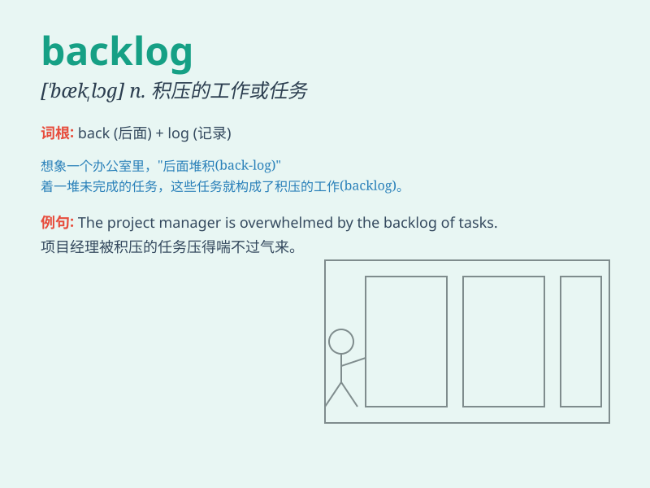

## backlog

**英音:** _[\'bæklɒg]_ **美音:** _[\'bæklɔɡ]_

**译义:** *n.大木材,订货*

### 短语

+ **order backlog:** _未交货订单；订单积压_

+ **production backlog:** _生产积压；生产延误_

+ **work backlog:** _工作积压；未完成的工作_

+ **backlog of cases:** _案件积压_

+ **backlog of complaints:** _投诉积压_

### 例句

#### 例句1

> **The company has a huge backlog of orders to fulfill.**

**中文翻译:** 该公司有大量积压订单需要履行。

**单词释义:** 积压的工作；未交付的订单

#### 例句2

> **There is a backlog of cases in the court.**

**中文翻译:** 法院积压了大量案件。

**单词释义:** 积压的事务

#### 例句3

> **The project has a backlog of tasks that need to be completed.**

**中文翻译:** 该项目有积压的任务需要完成。

**单词释义:** 积压的任务

### 背诵小故事

>
想象一个仓库，门口堆满了未处理的订单，就像一个'backlog'。工人们忙得不可开交，因为这些积压的订单太多了。这就是'backlog'，未处理的事务或积压的工作。

**想象一个仓库门口有大量未处理订单的场景来辅助理解'backlog'这个表示未处理的事务或积压的工作的单词。**

### 图义

