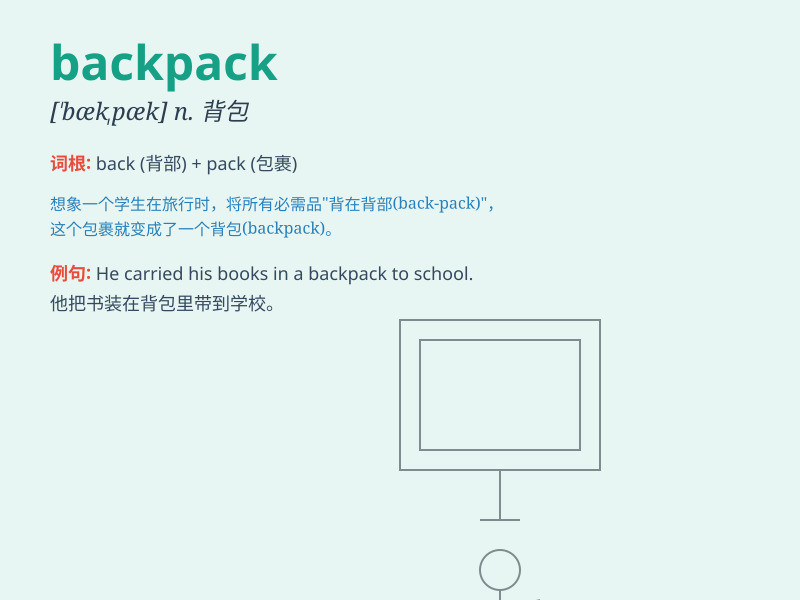

## backpack

**英音:** _[\'bækpæk]_ **美音:** _[\'bæk\'pæk]_

**译义:** *v.挑运n.挑运,背包*

### 短语

+ **school backpack:** _书包_

+ **travel backpack:** _旅行背包_

+ **heavy backpack:** _沉重的背包_

+ **wear a backpack:** _背着一个背包_

+ **backpack trip:** _背包旅行_

### 例句

#### 例句1

> **I always carry my books in my backpack.**

**中文翻译:** 我总是把书放在背包里。

**单词释义:** 背包

#### 例句2

> **She bought a new backpack for the trip.**

**中文翻译:** 她为这次旅行买了一个新背包。

**单词释义:** 背包

#### 例句3

> **The heavy backpack made him walk slowly.**

**中文翻译:** 沉重的背包让他走得很慢。

**单词释义:** 背包

### 背诵小故事

> One day, Tom was going on a trip. He put all his things into a big
bag on his back. This bag was called a backpack. It helped him carry
everything he needed. With his backpack, Tom was ready for the
adventure!

**一天，汤姆要去旅行。他把所有东西放进背上的一个大袋子里。这个袋子被称为背包。它帮助他携带所需的一切。带着他的背包，汤姆准备好去冒险了！**

### 图义

