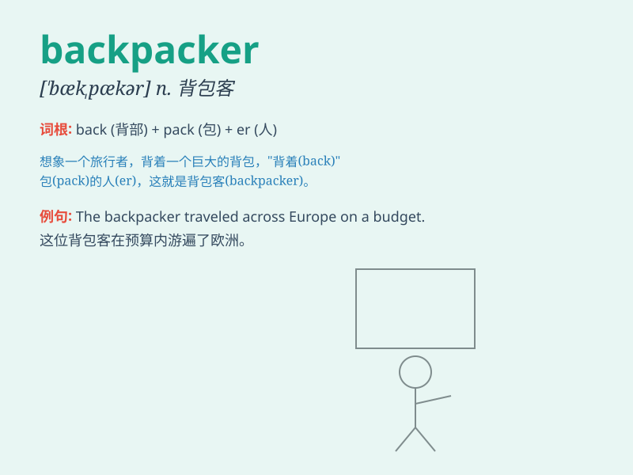

## backpacker

**英音:** _[ˈbækpækə(r)]_ **美音:** _[ˈbækpækə(r)]_

**译义:** *n.背包客；背包旅行者*

### 短语

+ **experienced backpacker:** _有经验的背包客_

+ **adventure backpacker:** _冒险背包客_

+ **budget backpacker:** _预算有限的背包客_

+ **solo backpacker:** _独自背包旅行的人_

+ **world-traveling backpacker:** _环球旅行的背包客_

### 例句

#### 例句1

> **The backpacker traveled across Europe with only a small
backpack.**

**中文翻译:** 这位背包客只带着一个小背包游历了欧洲。

**单词释义:** 背包客

#### 例句2

> **She met a friendly backpacker on the hiking trail.**

**中文翻译:** 她在徒步小道上遇到了一位友善的背包客。

**单词释义:** 背包客

#### 例句3

> **The backpacker was experienced in camping in the wild.**

**中文翻译:** 这位背包客在野外露营方面很有经验。

**单词释义:** 背包客

### 背诵小故事

> A young man always carried a big backpack and traveled around the
world. People called him a backpacker. He explored new places, met
different people, and had many wonderful adventures with his trusty
backpack.

**一个年轻人总是背着一个大背包环游世界。人们称他为背包客。他带着他可靠的背包探索新地方，结识不同的人，并有许多奇妙的冒险经历。**

### 图义

