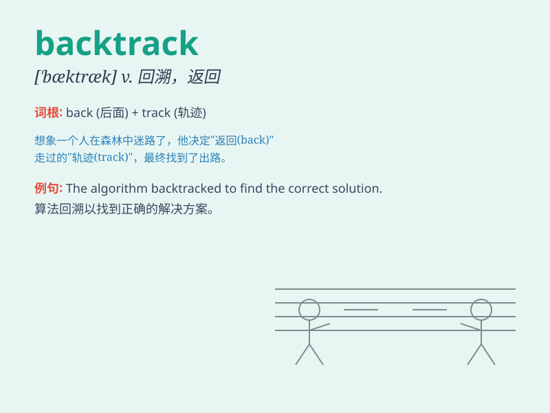

## backtrack

**英音:** _[\'bæktræk]_ **美音:** _[\'bæktræk]_

**译义:** *vi.(由原路)返回,退走,撤退,放弃*

### 短语

+ **backtrack on:** _违背；食言_

+ **backtrack from:** _从\...\...退缩；放弃_

+ **refuse to backtrack:** _拒绝退缩_

+ **attempt to backtrack:** _试图退缩_

+ **be forced to backtrack:** _被迫退缩_

### 例句

#### 例句1

> **The detective had to backtrack to find the missing clue.**

**中文翻译:** 侦探不得不原路返回，寻找失踪的线索。

**单词释义:** 回溯，原路返回

#### 例句2

> **We can\'t backtrack now; we have to keep moving forward.**

**中文翻译:** 我们现在不能走回头路；我们必须继续前进。

**单词释义:** 后退，退缩

#### 例句3

> **After realizing the mistake, he had to backtrack on his
decision.**

**中文翻译:** 意识到错误后，他不得不收回自己的决定。

**单词释义:** 改变（决定、计划等），走回头路

### 背诵小故事

> A detective was on a case but got some wrong clues. So, he had to
backtrack and start from the beginning to find the real criminal. It
means to go back over the same path or reverse a previous decision.

**一位侦探在办案时得到了一些错误的线索。所以，他不得不原路返回（backtrack），从头开始去寻找真正的罪犯。这个单词意思是走回头路或改变之前的决定。**

### 图义

