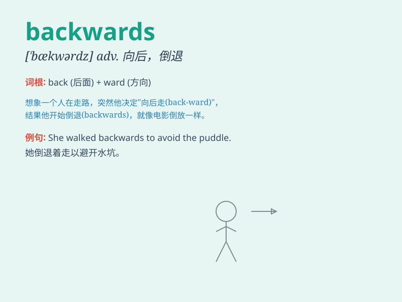

## backwards

**英音:** _[\'bækwədz]_ **美音:** _[\'bækwɚdz]_

**译义:** *adv.向后*

### 短语

+ **backwards and forwards:** _反复地；来回地_

+ **step backwards:** _后退；退步_

+ **lean backwards:** _向后倾斜_

+ **fall backwards:** _向后跌倒_

+ **look backwards:** _向后看_

### 例句

#### 例句1

> **He took a few steps backwards.**

**中文翻译:** 他向后退了几步。

**单词释义:** 向后

#### 例句2

> **The dancer moved backwards gracefully.**

**中文翻译:** 舞者优雅地向后退去。

**单词释义:** 向后

#### 例句3

> **She was looking backwards when she walked.**

**中文翻译:** 她走路时都在向后看。

**单词释义:** 向后

### 背诵小故事

>
想象一个人在黑暗中摸索着前进，突然发现自己走错了方向。他惊恐地大喊：\'I\'m
going backwards!\' 然后拼命转身往回走。这个场景能让我们记住 backwards
表示'向后；朝反方向'。

**想象一个人在黑暗中走错方向并喊出'我正在向后走！'的场景，来记住
backwards 表示'向后；朝反方向'**

### 图义

