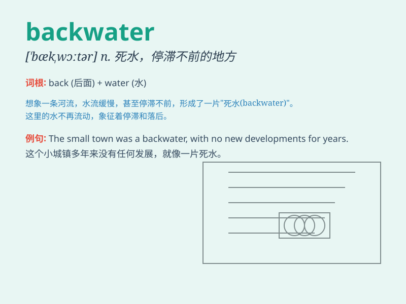

## backwater

**英音:** _[\'bækwɔːtə]_ **美音:** _[\'bækwɔtɚ]_

**译义:** *n.死水,停滞不进的状态或地方*

### 短语

+ **backwater area:** _落后地区_

+ **in the backwater:** _处于停滞状态_

+ **backwater village:** _偏僻的村庄_

+ **a backwater of history:** _历史的死角_

+ **backwater economy:** _落后的经济_

### 例句

#### 例句1

> **The small town was a backwater with few modern conveniences.**

**中文翻译:** 这个小镇是一潭死水，几乎没有现代化的便利设施。

**单词释义:** 落后的地区

#### 例句2

> **He grew up in a backwater village and had little exposure to the
outside world.**

**中文翻译:** 他在一个偏僻的村庄长大，很少接触外面的世界。

**单词释义:** 偏僻的地方

#### 例句3

> **The company\'s branch in that region became a backwater, lacking
innovation and growth.**

**中文翻译:** 该公司在该地区的分公司成了一潭死水，缺乏创新和发展。

**单词释义:** 停滞不前的地方或状态

### 背诵小故事

> A young adventurer was lost in a remote village. He called it a
\'backwater\' place, with no modern facilities and few connections to
the outside world. Later, he managed to escape and vowed never to return
to such a backward spot.

**一位年轻的冒险家在一个偏远的村庄迷路了。他称其为"死水"之地，没有现代化设施，与外界联系甚少。后来，他设法逃脱并发誓再也不回到这样落后的地方。**

### 图义

