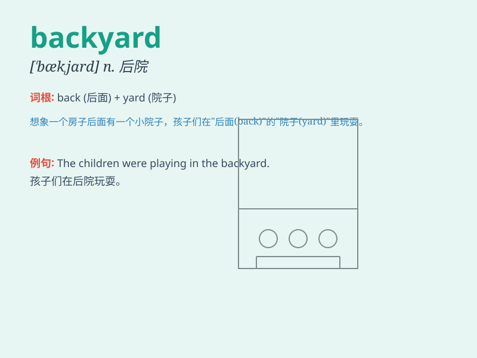

## backyard

**英音:** _[bæk\'jɑːd]_ **美音:** _[,bæk\'jɑrd]_

**译义:** *n.后院,后庭,\<美>(住宅的)场院*

### 短语

+ **in the backyard:** _在后院_

+ **backyard garden:** _后院花园_

+ **backyard barbecue:** _后院烧烤_

+ **backyard party:** _后院聚会_

+ **backyard playground:** _后院操场_

### 例句

#### 例句1

> **We often have barbecues in our backyard on weekends.**

**中文翻译:** 周末我们经常在后院烧烤。

**单词释义:** 后院

#### 例句2

> **The children were playing football in the backyard.**

**中文翻译:** 孩子们正在后院踢足球。

**单词释义:** 后院

#### 例句3

> **She grows vegetables in her backyard to save money.**

**中文翻译:** 为了省钱，她在后院种菜。

**单词释义:** 后院

### 背诵小故事

> One day, I was playing hide-and-seek in the backyard with my friends.
There were trees and flowers everywhere. We had so much fun running
around and laughing. The backyard became our secret paradise.

**有一天，我和朋友们在后院玩捉迷藏。后院到处都是树木和花朵。我们到处跑着、笑着，玩得非常开心。后院成了我们的秘密乐园。**

### 图义

