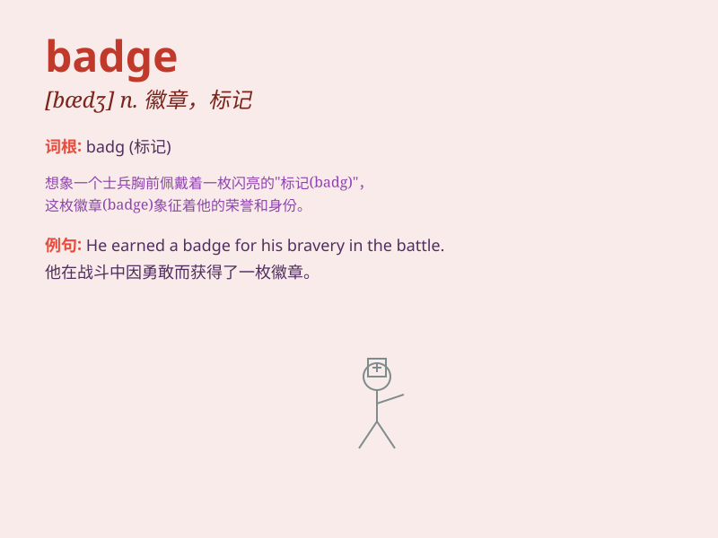

## badge

**英音:** _[bædʒ]_ **美音:** _[bædʒ]_

**译义:** *n.徽章,证章*

### 短语

+ **employee badge:** _员工徽章_

+ **name badge:** _姓名牌_

+ **security badge:** _安全徽章_

+ **visitor badge:** _访客徽章_

+ **badge of honor:** _荣誉勋章_

### 例句

#### 例句1

> **He wore a badge indicating his position as a security guard.**

**中文翻译:** 他戴着一枚徽章，表明他是一名保安。

**单词释义:** 徽章；标记

#### 例句2

> **The police officer\'s badge shone in the sunlight.**

**中文翻译:** 警察的徽章在阳光下闪闪发光。

**单词释义:** 徽章

#### 例句3

> **She received a badge of honor for her outstanding community
service.**

**中文翻译:** 她因其出色的社区服务而获得了荣誉徽章。

**单词释义:** 徽章；荣誉标志

### 背诵小故事

> A detective was on a case. The only clue was a small badge hidden in
a corner. It had a special symbol that led him to the criminal. The
badge was the key to solving the mystery.

**一位侦探在办案。唯一的线索是藏在角落里的一个小徽章。它上面有一个特殊的符号，引领他找到了罪犯。这个徽章是解开谜团的关键。**

### 图义

