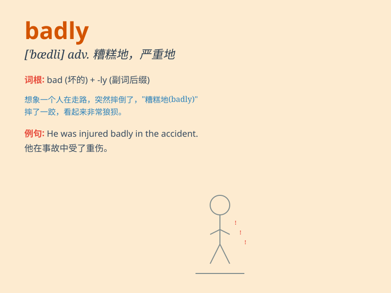

## badly

**英音:** _[\'bædlɪ]_ **美音:** _[\'bædli]_

**译义:** *adv.严重地,恶劣地*

### 短语

+ **badly off:** _穷困的；缺少的_

+ **be badly hurt:** _受重伤_

+ **behave badly:** _表现不好_

+ **want sth. badly:** _非常想要某物_

+ **do sth. badly:** _做某事做得很差_

### 例句

#### 例句1

> **He was injured badly in the accident.**

**中文翻译:** 他在事故中受了重伤。

**单词释义:** 严重地；厉害地

#### 例句2

> **She wants to go to the party very badly.**

**中文翻译:** 她非常想去参加聚会。

**单词释义:** 非常；很

#### 例句3

> **The machine is working badly.**

**中文翻译:** 机器运转不良。

**单词释义:** 不好地；差地

### 背诵小故事

> One day, a little boy fell off his bike and hurt his leg BADLY. He
needed to go to the hospital quickly. Everyone was worried about him.
The word \'badly\' here means seriously or severely.

**有一天，一个小男孩从自行车上摔下来，腿伤得很严重。他需要赶紧去医院。大家都很担心他。这里的'badly'这个单词意思是严重地；厉害地**

### 图义

