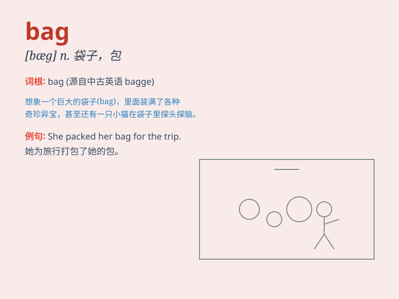

## bag

**英音:** _[bæg]_ **美音:** _[bæɡ]_

**译义:** *n.袋子,猎获物*

### 短语

+ **a bag of:** _一袋；一包_

+ **hand bag:** _手提包_

+ **travel bag:** _旅行包_

+ **sleeping bag:** _睡袋_

+ **shopping bag:** _购物袋_

### 例句

#### 例句1

> **She carried a big bag of books.**

**中文翻译:** 她提着一大袋书。

**单词释义:** 袋；包

#### 例句2

> **The thief snatched her bag and ran away.**

**中文翻译:** 小偷抢了她的包跑了。

**单词释义:** 包；手提包

#### 例句3

> **I need to buy a new bag for my trip.**

**中文翻译:** 我需要为我的旅行买一个新包。

**单词释义:** 包；旅行包

### 背诵小故事

> One day, Tom went on a trip. He carried a big bag filled with food
and water. But the bag was so heavy that he had a hard time. Finally, he
reached the destination and opened the bag happily.

**一天，汤姆去旅行。他带着一个装满食物和水的大袋子。但这个袋子太重了，他很吃力。最后，他到达了目的地，开心地打开了袋子。**

### 图义

