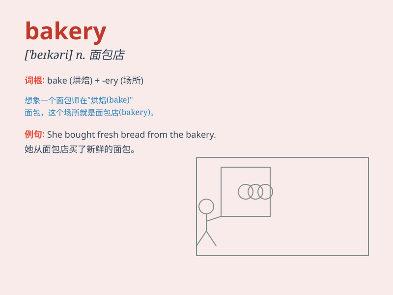

## bakery

**英音:** _[\'beɪk(ə)rɪ]_ **美音:** _[\'bekəri]_

**译义:** *n.面包店*

### 短语

+ **bakery product:** _烘焙产品_

+ **local bakery:** _当地的面包店_

+ **bakery chain:** _面包连锁店_

+ **traditional bakery:** _传统面包店_

+ **artisan bakery:** _手工面包店_

### 例句

#### 例句1

> **I often buy fresh bread from the local bakery.**

**中文翻译:** 我经常从当地的面包店买新鲜的面包。

**单词释义:** 面包店

#### 例句2

> **The bakery on the corner is very popular.**

**中文翻译:** 拐角处的那家面包店非常受欢迎。

**单词释义:** 面包店

#### 例句3

> **She works at a bakery and makes delicious cakes.**

**中文翻译:** 她在一家面包店工作，制作美味的蛋糕。

**单词释义:** 面包店

### 背诵小故事

> One day, I was walking in the street and felt hungry. Then I saw a
sign of \'bakery\'. I went in and smelled the delicious aroma. There
were all kinds of bread and cakes. I bought some and had a great time.

**有一天，我走在街上感到饿了。然后我看到一个写着'面包店'的招牌。我走进去，闻到了美味的香气。那里有各种各样的面包和蛋糕。我买了一些，度过了美好的时光。**

### 图义

