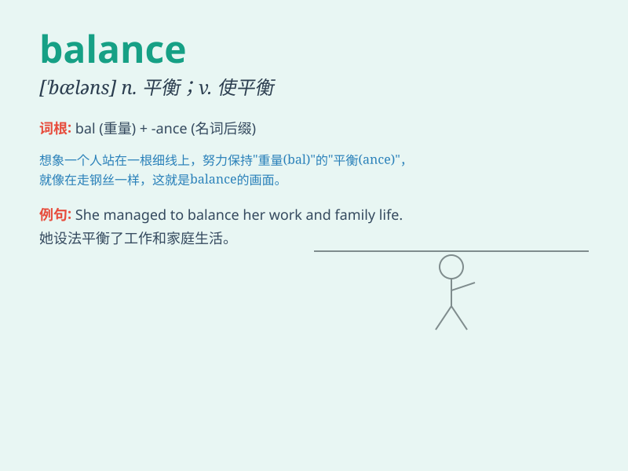

## balance

**英音:** _[\'bæl(ə)ns]_ **美音:** _[\'bæləns]_

**译义:** *n.秤,天平,平衡,[商]
收支差额,结余,余额v.平衡,称,权衡,对比,结算n.资产平稳表*

### 短语

+ **keep balance:** _保持平衡_

+ **lose balance:** _失去平衡_

+ **balance sheet:** _资产负债表_

+ **in balance:** _平衡的；均衡的_

+ **out of balance:** _不平衡；失去平衡_

### 例句

#### 例句1

> **I struggled to balance my work and personal life.**

**中文翻译:** 我努力平衡我的工作和个人生活。

**单词释义:** 使平衡；均衡

#### 例句2

> **The balance in my bank account is low.**

**中文翻译:** 我银行账户里的余额很少。

**单词释义:** 余额

#### 例句3

> **She lost her balance and fell down.**

**中文翻译:** 她失去平衡摔倒了。

**单词释义:** 平衡；平衡能力

### 背诵小故事

> Once upon a time, a tightrope walker struggled to keep his balance.
He focused hard, moving steadily. Finally, he achieved perfect balance
and crossed safely. Remember, \'balance\' means an even distribution of
weight or stability.

**从前，有个走钢丝的人努力保持平衡。他全神贯注，稳步移动。最终，他达到了完美的平衡并安全通过。记住，\'balance\'意思是重量的均匀分布或稳定。**

### 图义

