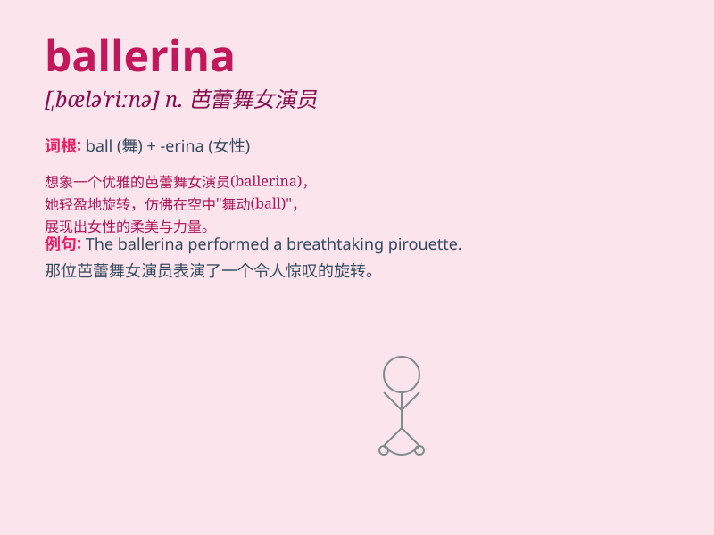

## ballerina

**英音:** _[bælə\'riːnə]_ **美音:** _[,bælə\'rinə]_

**译义:** *n.芭蕾舞女*

### 短语

+ **classical ballerina:** _古典芭蕾舞女演员_

+ **principal ballerina:** _首席芭蕾舞女演员_

+ **talented ballerina:** _有才华的芭蕾舞女演员_

+ **young ballerina:** _年轻的芭蕾舞女演员_

+ **famous ballerina:** _著名的芭蕾舞女演员_

### 例句

#### 例句1

> **The ballerina gracefully danced across the stage.**

**中文翻译:** 这位芭蕾舞女演员优雅地在舞台上跳舞。

**单词释义:** 芭蕾舞女演员

#### 例句2

> **She dreamed of becoming a famous ballerina one day.**

**中文翻译:** 她梦想有一天能成为一位著名的芭蕾舞女演员。

**单词释义:** 芭蕾舞女演员

#### 例句3

> **The young ballerina practiced for hours every day.**

**中文翻译:** 这位年轻的芭蕾舞女演员每天练习数小时。

**单词释义:** 芭蕾舞女演员

### 背诵小故事

> Once upon a time, there was a little girl who dreamed of becoming a
beautiful ballerina. She practiced every day, wearing her pink ballet
shoes. Finally, she danced gracefully on the stage. The word
\'ballerina\' reminds us of her pursuit of the ballet dream.

**从前，有一个小女孩梦想成为美丽的芭蕾舞女演员。她每天练习，穿着粉色的芭蕾舞鞋。最终，她在舞台上优雅地跳舞。单词\'ballerina\'让我们想起她对芭蕾舞梦想的追求。**

### 图义

