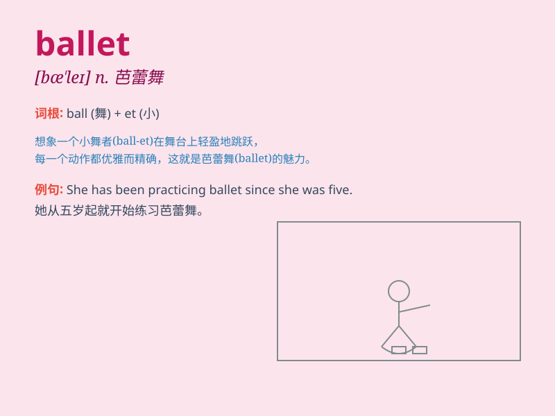

## ballet

**英音:** _[\'bæleɪ; -lɪ]_ **美音:** _[bæ\'le]_

**译义:** *n.芭蕾舞,芭蕾舞剧,芭蕾舞乐曲*

### 短语

+ **classical ballet:** _古典芭蕾舞_

+ **ballet dancer:** _芭蕾舞演员_

+ **ballet performance:** _芭蕾舞表演_

+ **ballet school:** _芭蕾舞学校_

+ **modern ballet:** _现代芭蕾舞_

### 例句

#### 例句1

> **She has been practicing ballet since she was five.**

**中文翻译:** 她从五岁起就一直在练习芭蕾舞。

**单词释义:** 芭蕾舞

#### 例句2

> **The ballet performance was breathtaking.**

**中文翻译:** 这场芭蕾舞表演令人叹为观止。

**单词释义:** 芭蕾舞

#### 例句3

> **He is a professional ballet dancer.**

**中文翻译:** 他是一名专业的芭蕾舞演员。

**单词释义:** 芭蕾舞

### 背诵小故事

> A little girl dreams of joining a ballet troupe. She practices every
day, leaping and twirling. Finally, she shines on the stage. The grace
and beauty of her ballet moves are unforgettable. Remember, ballet is
the art of dance!

**一个小女孩梦想加入芭蕾舞团。她每天练习，跳跃和旋转。最终，她在舞台上大放异彩。她芭蕾舞动作的优雅和美丽令人难以忘怀。记住，ballet
就是芭蕾舞！**

### 图义

