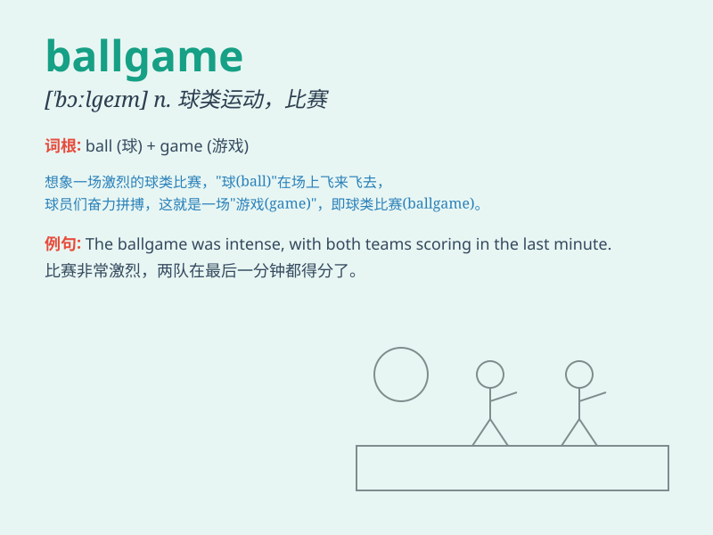

## ballgame

**英音:** _[ˈbɔːlɡeɪm]_ **美音:** _[ˈbɔːlɡeɪm]_

**译义:** *n.棒球运动；（喻）游戏，活动*

### 短语

+ **baseball game:** _棒球比赛_

+ **football game:** _足球比赛_

+ **basketball game:** _篮球比赛_

+ **ballgame field:** _球赛场地_

+ **attend a ballgame:** _参加球赛_

### 例句

#### 例句1

> **The baseball game was very exciting.**

**中文翻译:** 这场棒球比赛非常令人兴奋。

**单词释义:** 比赛；球类比赛

#### 例句2

> **It\'s a whole new ballgame when it comes to online shopping.**

**中文翻译:** 谈到网上购物，那完全是另一回事了。

**单词释义:** 情况；局面

#### 例句3

> **He knows the ins and outs of the ballgame.**

**中文翻译:** 他了解这个比赛的里里外外。

**单词释义:** 比赛

### 背诵小故事

> One day, I went to a park and saw many people playing a ballgame.
They were running, passing the ball, and having so much fun. It was a
lively scene of teamwork and competition.

**有一天，我去公园看到很多人在玩球类比赛。他们奔跑着、传球，玩得非常开心。那是充满团队合作和竞争的热闹场景。**

### 图义

