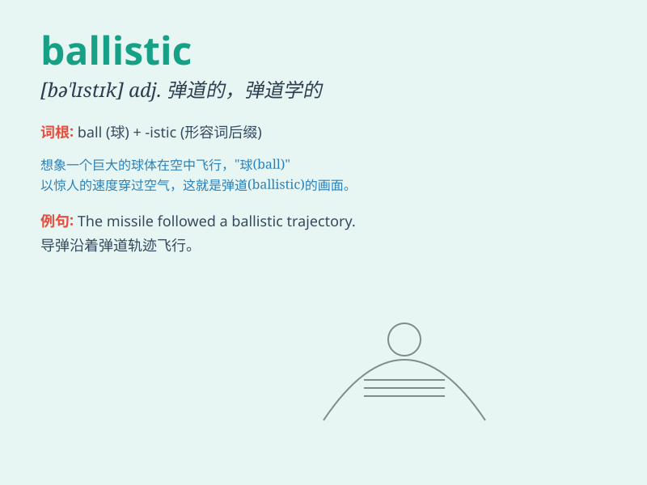

## ballistic

**英音:** _[bə\'lɪstɪk]_ **美音:** _[bə\'lɪstɪk]_

**译义:** *adj.弹道的,弹道学的*

### 短语

+ **ballistic missile:** _弹道导弹_

+ **ballistic trajectory:** _弹道轨迹_

+ **ballistic evidence:** _弹道证据_

+ **ballistic testing:** _弹道测试_

+ **ballistic movement:** _弹道运动_

### 例句

#### 例句1

> **The missile has a ballistic trajectory.**

**中文翻译:** 这枚导弹有一个弹道轨迹。

**单词释义:** 弹道的

#### 例句2

> **He went ballistic when he heard the news.**

**中文翻译:** 他听到这个消息时暴跳如雷。

**单词释义:** 狂怒的；暴怒的

#### 例句3

> **The study of ballistic science is crucial for national
defense.**

**中文翻译:** 弹道科学的研究对国防至关重要。

**单词释义:** 弹道学的

### 背诵小故事

> A thief was running away after stealing. The police were chasing him.
The thief\'s escape was so fast and wild that it was described as
\'ballistic\'. Finally, the police caught him.

**一个小偷偷完东西后逃跑。警察在追捕他。小偷逃窜的速度又快又疯狂，这被形容为\'ballistic\'。最终，警察抓住了他。**

### 图义

