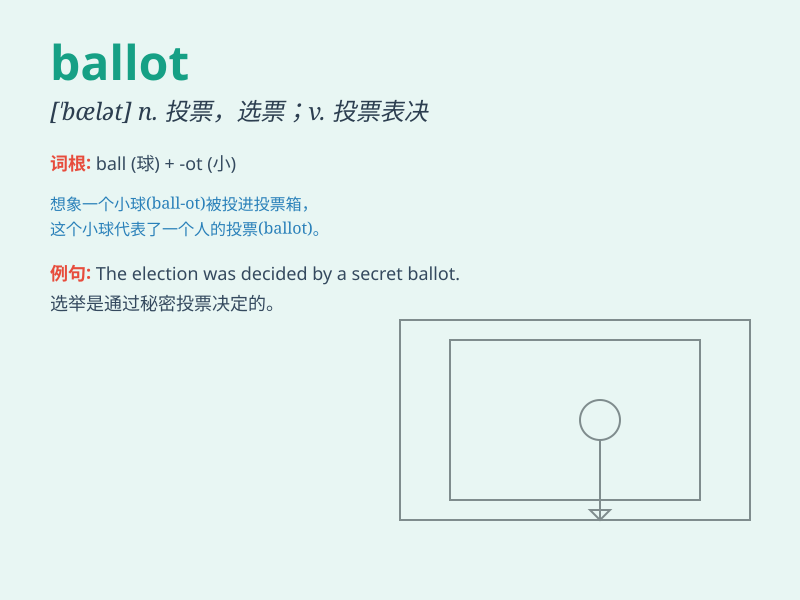

## ballot

**英音:** _[\'bælət]_ **美音:** _[\'bælət]_

**译义:** *n.选举票,投票,票数vi.投票*

### 短语

+ **ballot box:** _投票箱_

+ **secret ballot:** _无记名投票_

+ **ballot paper:** _选票_

+ **cast a ballot:** _投票_

+ **ballot for:** _为\...\...投票_

### 例句

#### 例句1

> **The ballot box was sealed and transported to the counting
center.**

**中文翻译:** 投票箱被密封并运送到计票中心。

**单词释义:** 投票箱

#### 例句2

> **She cast her ballot for the candidate she believed in.**

**中文翻译:** 她为她信任的候选人投了票。

**单词释义:** 选票；投票

#### 例句3

> **The results of the ballot will be announced tomorrow.**

**中文翻译:** 投票结果将于明天公布。

**单词释义:** 投票

### 背诵小故事

> In a small town\'s election, people put their choices in sealed
boxes. The papers they put in were called ballots. Everyone was serious
as they marked their preferences on these ballots to decide the future
of the town.

**在一个小镇的选举中，人们把他们的选择放进密封的箱子里。他们放进去的纸张被称为选票。每个人都很认真，在这些选票上标记他们的偏好，以决定小镇的未来。**

### 图义

