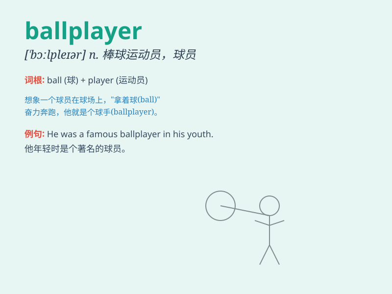

## ballplayer

**英音:** _[\'bɔːl,pleɪə]_ **美音:** _[\'bɔl,pleɚ]_

**译义:** *n.棒球手*

### 短语

+ **professional ballplayer:** _职业球员_

+ **star ballplayer:** _明星球员_

+ **young ballplayer:** _年轻球员_

+ **experienced ballplayer:** _经验丰富的球员_

+ **outstanding ballplayer:** _杰出的球员_

### 例句

#### 例句1

> **The ballplayer hit a home run in the final inning.**

**中文翻译:** 这位球员在最后一局打出了一个本垒打。

**单词释义:** 球员

#### 例句2

> **The young ballplayer showed great potential during the training
camp.**

**中文翻译:** 这位年轻的球员在训练营期间展现出了巨大的潜力。

**单词释义:** 球员

#### 例句3

> **The injured ballplayer was forced to sit out the rest of the
season.**

**中文翻译:** 这位受伤的球员被迫缺席本赛季剩余的比赛。

**单词释义:** 球员

### 背诵小故事

> Once upon a time, there was a boy who loved playing with balls. He
practiced every day and became an excellent ballplayer. People cheered
for him when he showed his amazing skills on the field.

**从前，有个男孩喜欢玩球。他每天练习，成为了一名出色的球类运动员。当他在球场上展示惊人的技巧时，人们为他欢呼。**

### 图义

