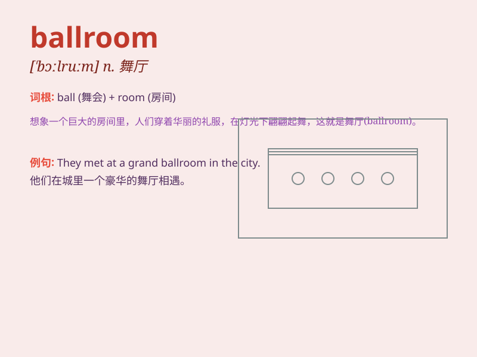

## ballroom

**英音:** _[\'bɔːlruːm; -rʊm]_ **美音:** _[\'bɔl\'rʊm]_

**译义:** *n.舞厅,跳舞场*

### 短语

+ **ballroom dancing:** _交际舞_

+ **ballroom gown:** _舞会礼服_

+ **ballroom music:** _舞厅音乐_

+ **ballroom floor:** _舞池地板_

+ **ballroom etiquette:** _舞厅礼仪_

### 例句

#### 例句1

> **The couple danced gracefully in the ballroom.**

**中文翻译:** 这对夫妇在舞厅里优雅地跳舞。

**单词释义:** 舞厅

#### 例句2

> **The hotel has a magnificent ballroom for events.**

**中文翻译:** 这家酒店有一个宏伟的用于举办活动的舞厅。

**单词释义:** 舞厅

#### 例句3

> **She entered the ballroom wearing a beautiful gown.**

**中文翻译:** 她穿着一件漂亮的礼服走进了舞厅。

**单词释义:** 舞厅

### 背诵小故事

> A prince and a princess entered a big room full of colorful balls for
a dance. This room was called the \'ballroom\'. They had a wonderful
time dancing together.

**一位王子和一位公主走进了一个满是彩色球的大房间去跳舞。这个房间被称为"舞厅"。他们一起跳舞，度过了美好的时光。**

### 图义

