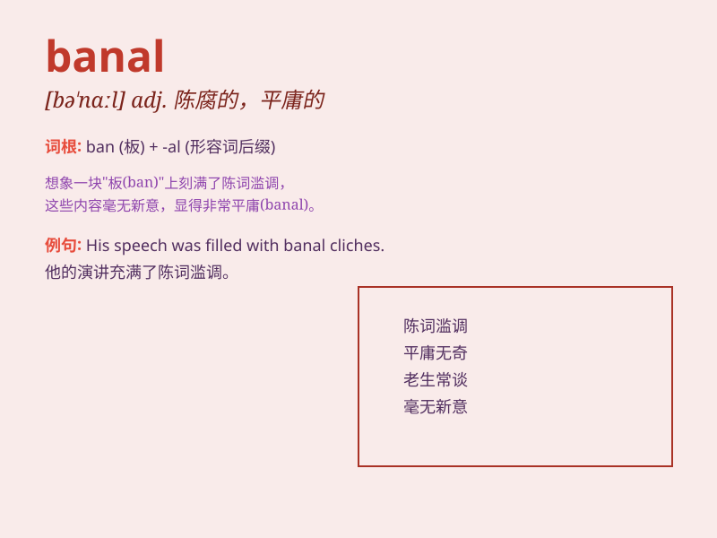

## banal

**英音:** _[bə\'nɑːl; -\'næl]_ **美音:** _[bə\'nɑl]_

**译义:** *adj.平凡的,陈腐的,老一套的*

### 短语

+ **banal remark:** _陈腐的言论_

+ **banal topic:** _平庸的主题_

+ **banal conversation:** _无聊的谈话_

+ **banal idea:** _平淡无奇的想法_

+ **banal expression:** _陈词滥调_

### 例句

#### 例句1

> **The movie\'s plot was banal and predictable.**

**中文翻译:** 这部电影的情节平庸且可预测。

**单词释义:** 平淡的；陈腐的

#### 例句2

> **His speech was full of banal phrases.**

**中文翻译:** 他的讲话充满了陈词滥调。

**单词释义:** 平庸的；乏味的

#### 例句3

> **The book offers nothing but banal advice.**

**中文翻译:** 这本书只提供了一些平庸的建议。

**单词释义:** 平常的；司空见惯的

### 背诵小故事

> A man always repeated the same banal jokes. Everyone got bored. But
one day, he came up with a fresh and funny one. From then on, no more
banal jokes from him.

**一个男人总是重复同样无聊的笑话。每个人都感到厌烦。但有一天，他想出了一个新鲜有趣的。从那以后，他不再讲那些无聊的笑话了。**

### 图义

