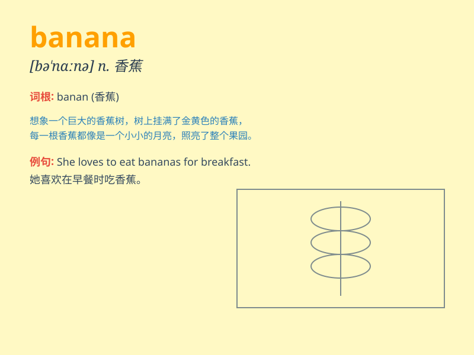

## banana

**英音:** _[bə\'nɑːnə]_ **美音:** _[bə\'nænə]_

**译义:** *n.香蕉*

### 短语

+ **banana peel:** _香蕉皮_

+ **banana split:** _香蕉船（一种冰淇淋甜点）_

+ **banana republic:**
_香蕉共和国（指经济单一、政治不稳定的小国家）_

+ **top banana:** _主要人物；大老板_

+ **second banana:** _配角；次要人物_

### 例句

#### 例句1

> **I like to eat bananas for breakfast.**

**中文翻译:** 我早餐喜欢吃香蕉。

**单词释义:** 香蕉（名词）

#### 例句2

> **The monkey is holding a banana in its hand.**

**中文翻译:** 猴子手里拿着一根香蕉。

**单词释义:** 香蕉（名词）

#### 例句3

> **She bought a bunch of bananas from the market.**

**中文翻译:** 她从市场上买了一串香蕉。

**单词释义:** 香蕉（名词）

### 背诵小故事

> A monkey loves bananas very much. One day, it found a big bunch of
bananas in the forest. It was so happy and ate them all. From then on,
whenever it was hungry, it would look for bananas.

**一只猴子非常喜欢香蕉。有一天，它在森林里发现了一大串香蕉。它非常高兴，把它们全吃了。从那以后，每当它饿了，就会去找香蕉。**

### 图义

