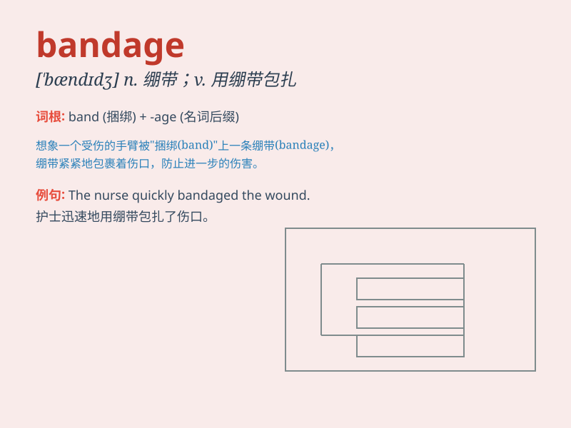

## bandage

**英音:** _[\'bændɪdʒ]_ **美音:** _[\'bændɪdʒ]_

**译义:** *n.绷带*

### 短语

+ **elastic bandage:** _弹性绷带_

+ **sterile bandage:** _无菌绷带_

+ **wound bandage:** _伤口绷带_

+ **medical bandage:** _医用绷带_

+ **bandage up:** _用绷带包扎_

### 例句

#### 例句1

> **The doctor applied a bandage to the patient\'s wound.**

**中文翻译:** 医生给病人的伤口包扎绷带。

**单词释义:** 绷带；用绷带包扎

#### 例句2

> **She had a bandage around her ankle.**

**中文翻译:** 她的脚踝周围缠着绷带。

**单词释义:** 绷带

#### 例句3

> **He quickly bandaged the injured finger.**

**中文翻译:** 他赶紧包扎受伤的手指。

**单词释义:** 用绷带包扎

### 背诵小故事

> One day, Tom had a bad fall and hurt his leg. His friend quickly
brought a bandage to wrap around the wound. With the bandage, Tom felt
much better and was able to walk again.

**一天，汤姆摔了一跤，腿受伤了。他的朋友迅速拿来一条绷带包扎伤口。有了绷带，汤姆感觉好多了，又能走路了。**

### 图义

