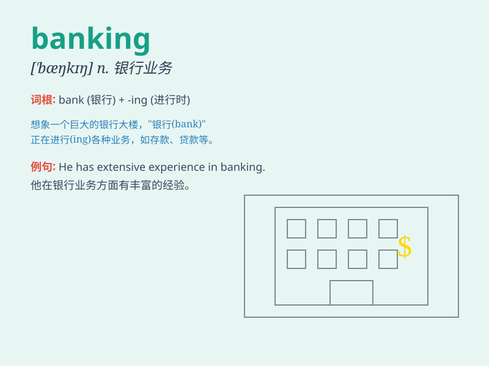

## banking

**英音:** _[\'bæŋkɪŋ]_ **美音:** _[\'bæŋkɪŋ]_

**译义:** *n.银行业*

### 短语

+ **investment banking:** _投资银行业务_

+ **retail banking:** _零售银行业务_

+ **corporate banking:** _公司银行业务_

+ **internet banking:** _网上银行_

+ **mobile banking:** _手机银行_

### 例句

#### 例句1

> **I\'m interested in a career in banking.**

**中文翻译:** 我对银行业的职业感兴趣。

**单词释义:** 银行（业）

#### 例句2

> **Banking services have become more convenient with the development
of technology.**

**中文翻译:** 随着科技的发展，银行服务变得更加便捷。

**单词释义:** 银行业务；银行服务

#### 例句3

> **He has extensive experience in international banking.**

**中文翻译:** 他在国际银行业务方面拥有丰富的经验。

**单词释义:** 银行业

### 背诵小故事

> One day, Tom wanted to save money. So he went to a place called
banking. There, friendly staff helped him manage his money and plan for
the future. Now, whenever Tom thinks of banking, he remembers this
helpful experience.

**有一天，汤姆想要存钱。于是他去了一个叫银行的地方。在那里，友好的工作人员帮助他管理他的钱并为未来做规划。现在，每当汤姆想到银行业，他就会想起这段有用的经历。**

### 图义

