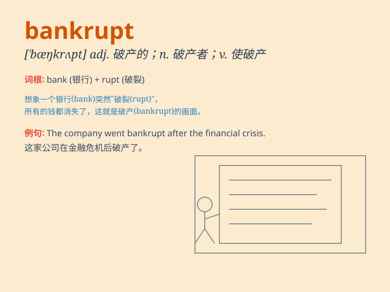

## bankrupt

**英音:** _[\'bæŋkrʌpt]_ **美音:** _[\'bæŋkrʌpt]_

**译义:** *n.破产者adj.破产了的,完全丧失vt.使破产*

### 短语

+ **go bankrupt:** _破产；倒闭_

+ **declare bankrupt:** _宣告破产_

+ **bankrupt estate:** _破产财产_

+ **bankrupt law:** _破产法_

+ **bankrupt company:** _破产公司_

### 例句

#### 例句1

> **The company went bankrupt last year.**

**中文翻译:** 该公司去年破产了。

**单词释义:** 破产

#### 例句2

> **His bad investments led him to be bankrupt.**

**中文翻译:** 他的错误投资导致他破产。

**单词释义:** 破产

#### 例句3

> **The business was declared bankrupt by the court.**

**中文翻译:** 该企业被法院宣布破产。

**单词释义:** 破产

### 背诵小故事

> A businessman had a bank full of money. But he made bad decisions and
lost it all. His business failed, and he became bankrupt. Now, he has no
money and owes a lot to others.

**一位商人原本银行里有满满的钱。但他做了糟糕的决策，失去了一切。他的生意失败了，变得破产。现在，他没钱还欠了别人很多。**

### 图义

