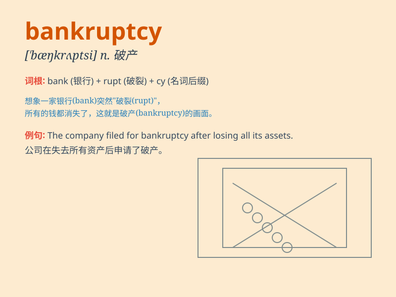

## bankruptcy

**英音:** _[\'bæŋkrʌptsɪ]_ **美音:** _[\'bæŋkrʌptsi]_

**译义:** *n.破产*

### 短语

+ **declare bankruptcy:** _宣告破产_

+ **go into bankruptcy:** _破产；陷入破产_

+ **avoid bankruptcy:** _避免破产_

+ **bankruptcy law:** _破产法_

+ **bankruptcy proceedings:** _破产程序_

### 例句

#### 例句1

> **The company faced bankruptcy due to poor management.**

**中文翻译:** 由于经营不善，该公司面临破产。

**单词释义:** 破产

#### 例句2

> **His business went into bankruptcy last year.**

**中文翻译:** 他的公司去年破产了。

**单词释义:** 破产

#### 例句3

> **The threat of bankruptcy forced them to make radical changes.**

**中文翻译:** 破产的威胁迫使他们做出彻底的改变。

**单词释义:** 破产

### 背诵小故事

> A businessman was in deep trouble. His company had too many debts and
couldn\'t pay. Finally, it faced bankruptcy. It was like a ship sinking
in a stormy sea. Poor him!

**一位商人陷入了巨大的困境。他的公司负债累累，无法偿还。最终，面临破产。这就像一艘船在狂风暴雨的大海中沉没。真可怜！**

### 图义

