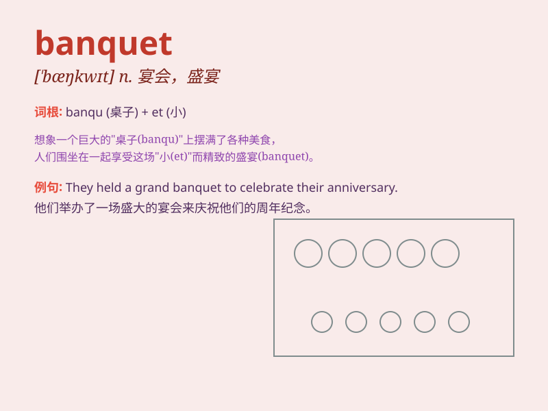

## banquet

**英音:** _[\'bæŋkwɪt]_ **美音:** _[\'bæŋkwɪt]_

**译义:** *n.宴会*

### 短语

+ **wedding banquet:** _婚宴_

+ **state banquet:** _国宴_

+ **banquet hall:** _宴会厅_

+ **give a banquet:** _举行宴会_

+ **attend a banquet:** _参加宴会_

### 例句

#### 例句1

> **The wedding banquet was a grand affair.**

**中文翻译:** 婚宴办得很隆重。

**单词释义:** 宴会

#### 例句2

> **They held a banquet to celebrate the company\'s anniversary.**

**中文翻译:** 他们举办了宴会庆祝公司周年纪念日。

**单词释义:** 宴会

#### 例句3

> **The state banquet was attended by many foreign dignitaries.**

**中文翻译:** 许多外国政要出席国宴。

**单词释义:** 宴会

### 背诵小故事

> 国王举办了一场盛大的
banquet（宴会）来庆祝胜利。宴会上摆满了美味的食物和香醇的美酒，人们欢声笑语，尽情享受。这场
banquet 让所有人都难以忘怀。

**国王举办了一场盛大的宴会来庆祝胜利。宴会上摆满了美味的食物和香醇的美酒，人们欢声笑语，尽情享受。这场宴会让所有人都难以忘怀。**

### 图义

