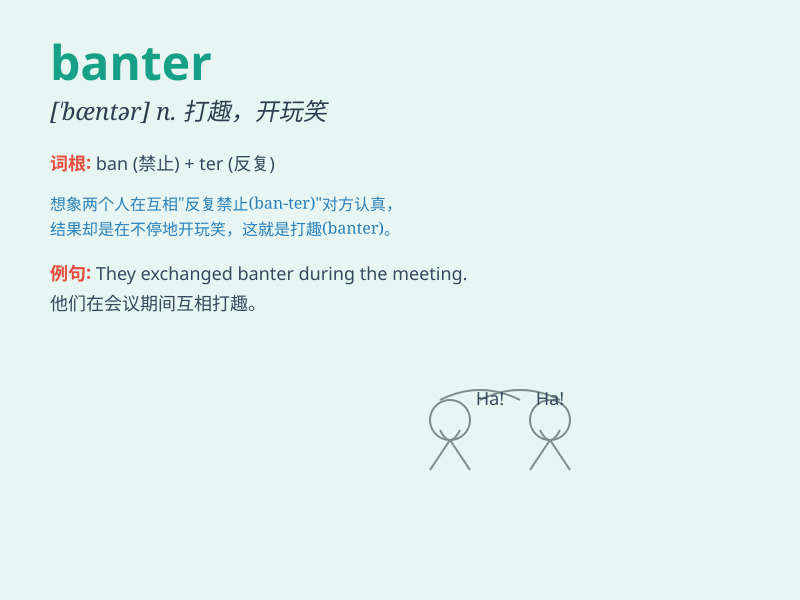

## banter

**英音:** _[\'bæntə]_ **美音:** _[\'bæntɚ]_

**译义:** *n.善意地取笑,逗弄v.善意的与人开玩笑*

### 短语

+ **good-natured banter:** _善意的玩笑_

+ **exchange banter:** _互相开玩笑_

+ **light-hearted banter:** _轻松愉快的玩笑_

+ **engaging banter:** _吸引人的打趣_

+ **witty banter:** _诙谐的玩笑话_

### 例句

#### 例句1

> **They engaged in light-hearted banter at the party.**

**中文翻译:** 他们在聚会上进行轻松的玩笑。

**单词释义:** 开玩笑，打趣

#### 例句2

> **The colleagues often exchange banter during breaks.**

**中文翻译:** 休息时，同事们经常互相开玩笑。

**单词释义:** 调侃，戏谑

#### 例句3

> **His banter made everyone in the room laugh.**

**中文翻译:** 他的玩笑让房间里的每个人都笑了起来。

**单词释义:** 玩笑，俏皮话

### 背诵小故事

>
有一天，小明和小红在轻松愉快地聊天，互相开着玩笑，这种轻松诙谐的交流就是
banter。他们的 banter 充满了欢笑，让周围的人也感到快乐。

**有一天，小明和小红在轻松愉快地开玩笑、打趣，这种轻松诙谐的交流方式就是'banter'。他们的'banter'充满了欢笑，让周围的人也感到快乐。**

### 图义

