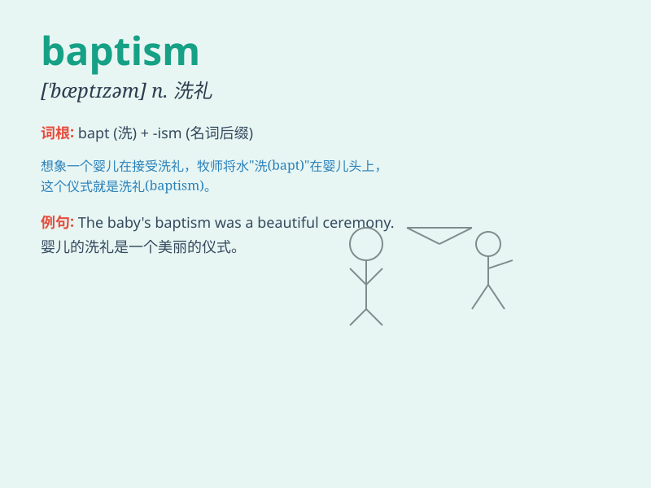

## baptism

**英音:** _[\'bæptɪz(ə)m]_ **美音:** _[\'bæptɪzəm]_

**译义:** *n.浸洗,[喻]洗礼,严峻考验*

### 短语

+ **baptism of fire:** _严峻的考验；战火的洗礼_

+ **baptism by immersion:** _浸水礼_

+ **baptism certificate:** _洗礼证书_

+ **baptism service:** _洗礼仪式_

+ **baptism font:** _洗礼盆_

### 例句

#### 例句1

> **The baptism ceremony was a solemn and beautiful event.**

**中文翻译:** 洗礼仪式是一个庄严而美丽的活动。

**单词释义:** 洗礼

#### 例句2

> **She received baptism when she was a baby.**

**中文翻译:** 她在还是婴儿的时候接受了洗礼。

**单词释义:** 洗礼

#### 例句3

> **Baptism is an important religious ritual for many Christians.**

**中文翻译:** 对于许多基督徒来说，洗礼是一个重要的宗教仪式。

**单词释义:** 洗礼

### 背诵小故事

> A young man was very nervous before his baptism. He prayed and
finally took the brave step into the holy water. It was a moment of
spiritual transformation and new beginning.

**一个年轻人在他的洗礼之前非常紧张。他祈祷着，最终勇敢地踏入了圣水。这是一个精神转变和新开始的时刻。**

### 图义

