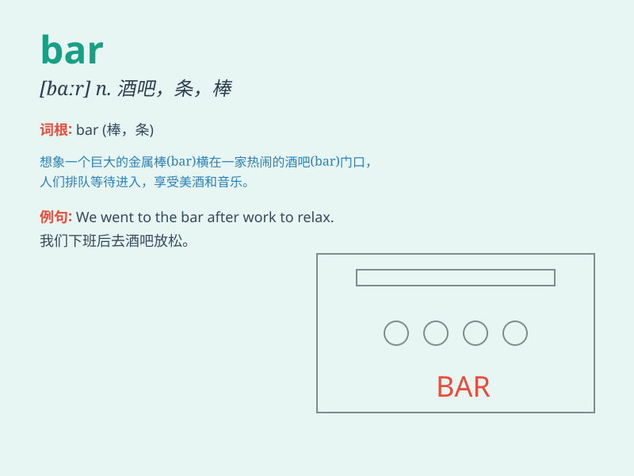

## bar

**英音:** _[bɑː]_ **美音:** _[bɑr]_

**译义:**
*n.条,棒(常用作栅栏,扣栓物),横木,酒吧间,栅,障碍物vt.禁止,阻挡,妨碍,把门关住,除\...之外,(Bar)律师业
/n.条形/柱形图*

### 短语

+ **behind bars:** _在狱中；被监禁_

+ **bar chart:** _条形图；柱状图_

+ **snack bar:** _小吃店；快餐柜_

+ **set the bar high:** _设定高标准_

+ **bar code:** _条形码_

### 例句

#### 例句1

> **He walked into the bar and ordered a drink.**

**中文翻译:** 他走进酒吧并点了一杯饮料。

**单词释义:** 酒吧

#### 例句2

> **The bar of chocolate was very delicious.**

**中文翻译:** 这块巧克力棒非常美味。

**单词释义:** 条；棒

#### 例句3

> **The police put a bar across the road to stop the traffic.**

**中文翻译:** 警察在马路上设置了横杆来阻止交通。

**单词释义:** 横杆；障碍

### 背诵小故事

> A man was trapped behind a bar in a strange room. He struggled to get
out but the bar was too strong. Finally, he found a way to break the bar
and escape. Remember, \'bar\' means a barrier or something that blocks.

**一个男人被困在一个奇怪房间的一根横杆后面。他努力想出去，但横杆太坚固了。最后，他找到了打破横杆并逃脱的方法。记住，\'bar\'有横杆、障碍或阻拦物的意思。**

### 图义

