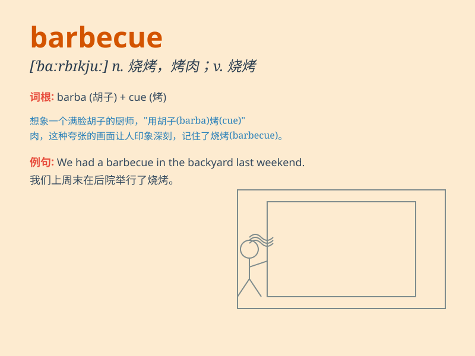

## barbecue

**英音:** _[\'bɑːbɪkjuː]_ **美音:** _[\'bɑrbɪkju]_

**译义:** *n.吃烤烧肉的野餐*

### 短语

+ **barbecue grill:** _烧烤架_

+ **barbecue sauce:** _烧烤酱_

+ **outdoor barbecue:** _户外烧烤_

+ **barbecue party:** _烧烤派对_

+ **electric barbecue:** _电烧烤_

### 例句

#### 例句1

> **We had a barbecue in the park last weekend.**

**中文翻译:** 上周末我们在公园进行了烧烤。

**单词释义:** 烧烤；烤肉

#### 例句2

> **The smell of the barbecue made my mouth water.**

**中文翻译:** 烧烤的香味让我流口水了。

**单词释义:** 烧烤

#### 例句3

> **He is in charge of the barbecue at the party.**

**中文翻译:** 他负责派对上的烧烤事宜。

**单词释义:** 烧烤

### 背诵小故事

> One sunny day, my friends and I went to a park. We had a barbecue. We
grilled sausages and burgers. The smell was so good. We had a great time
eating and chatting around the barbecue.

**在一个阳光明媚的日子，我和朋友们去了公园。我们进行了烧烤。烤了香肠和汉堡。味道特别香。我们围在烧烤架旁，边吃边聊，度过了愉快的时光。**

### 图义

