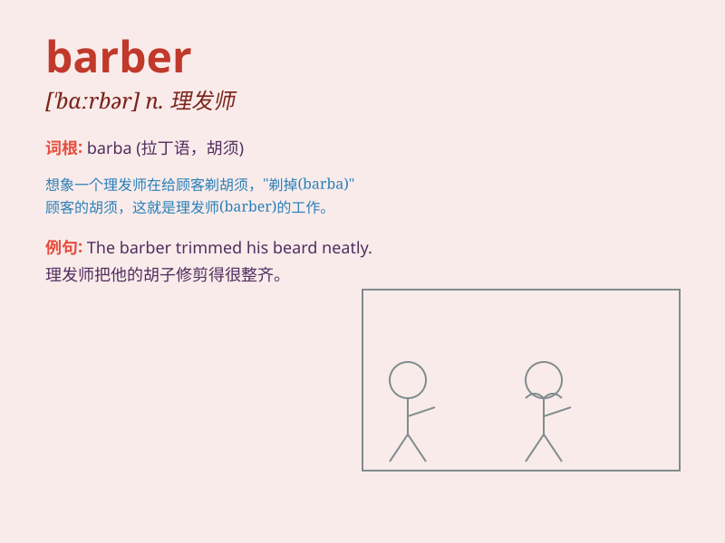

## barber

**英音:** _[\'bɑːbə]_ **美音:** _[\'bɑrbɚ]_

**译义:** *n.理发员,理发师vt.为\...理发,刮脸等*

### 短语

+ **barber shop:** _理发店_

+ **barber pole:** _理发店的旋转招牌_

+ **barber chair:** _理发椅_

+ **barber scissors:** _理发剪刀_

+ **visiting the barber:** _去理发_

### 例句

#### 例句1

> **I need to go to the barber to get a haircut.**

**中文翻译:** 我需要去理发师那里剪头发。

**单词释义:** 理发师

#### 例句2

> **The barber trimmed my beard neatly.**

**中文翻译:** 理发师把我的胡子修剪得很整齐。

**单词释义:** 理发师

#### 例句3

> **My father has been going to the same barber for years.**

**中文翻译:** 我父亲多年来一直去同一位理发师那里理发。

**单词释义:** 理发师

### 背诵小故事

> One day, Tom was in a hurry for a party. He rushed to the barber\'s
shop. The barber skillfully cut and styled his hair. Tom left looking
handsome and ready to enjoy the party.

**一天，汤姆着急去参加一个聚会。他匆忙赶到理发店。理发师熟练地给他剪发并做造型。汤姆离开时看起来很帅，准备好去享受聚会了。**

### 图义

