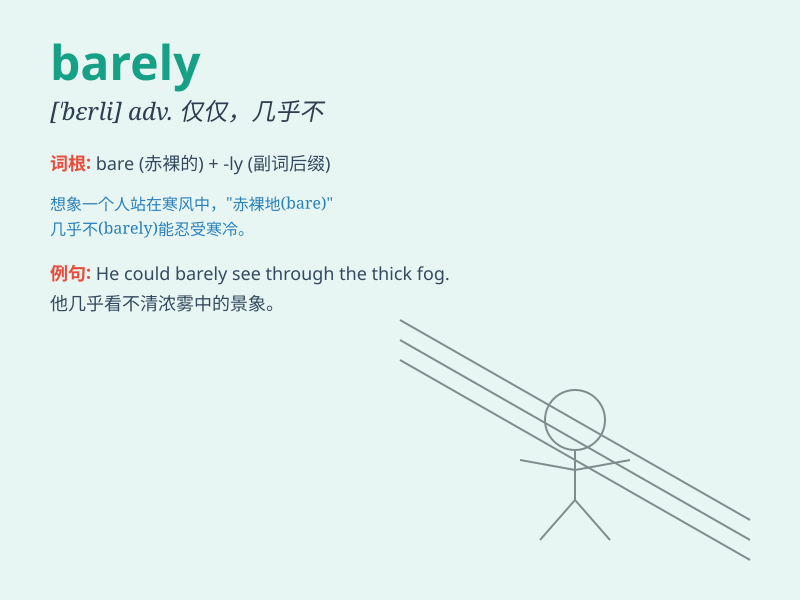

## barely

**英音:** _[\'beəlɪ]_ **美音:** _[\'bɛrli]_

**译义:** *adv.仅仅,刚刚,几乎不能*

### 短语

+ **barely enough:** _仅仅足够_

+ **barely audible:** _几乎听不见_

+ **barely visible:** _几乎看不见_

+ **barely escape:** _勉强逃脱_

+ **barely pass:** _勉强通过_

### 例句

#### 例句1

> **I barely passed the exam.**

**中文翻译:** 我几乎没通过考试。

**单词释义:** 几乎不

#### 例句2

> **She barely had time to catch her breath.**

**中文翻译:** 她几乎没时间喘口气。

**单词释义:** 几乎没有

#### 例句3

> **He could barely stand up after the long run.**

**中文翻译:** 长跑之后他几乎站不起来了。

**单词释义:** 几乎不能

### 背诵小故事

>
想象一下，你在沙漠中行走，水壶里的水几乎没了（barely）。你口渴难耐，每一滴水都显得无比珍贵。这时的
barely 就意味着仅仅、几乎没有。

**想象在沙漠中，水壶里的水几乎没了，来理解 barely
表示仅仅、几乎没有的意思。**

### 图义

