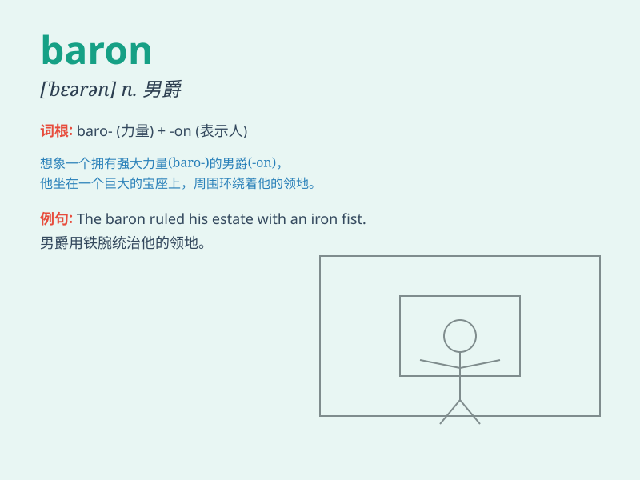

## baron

**英音:** _[\'bær(ə)n]_ **美音:** _[\'bærən]_

**译义:** *n.男爵(英国世袭的最低级的贵族爵位)*

### 短语

+ **oil baron:** _石油大亨_

+ **media baron:** _传媒大亨_

+ **baron of industry:** _工业巨头_

+ **land baron:** _地产大亨_

+ **financial baron:** _金融巨头_

### 例句

#### 例句1

> **The baron owned a large estate.**

**中文翻译:** 男爵拥有一大片庄园。

**单词释义:** 男爵

#### 例句2

> **He was elevated to the rank of baron.**

**中文翻译:** 他被提升为男爵军衔。

**单词释义:** 男爵

#### 例句3

> **The baron is a powerful figure in the business world.**

**中文翻译:** 男爵是商界的有权有势的人物。

**单词释义:** 男爵；巨头

### 背诵小故事

> A baron was a powerful and wealthy nobleman. Imagine a baron riding a
big white horse, wearing shiny armor, and owning a huge castle. His land
was vast and everyone respected him. Remember, baron means a nobleman of
high rank.

**一位男爵是有权有势且富有的贵族。想象一位男爵骑着一匹高大的白马，身着闪亮的盔甲，拥有一座巨大的城堡。他的领地广阔，人人都尊敬他。记住，baron
意思是男爵，高级贵族。**

### 图义

