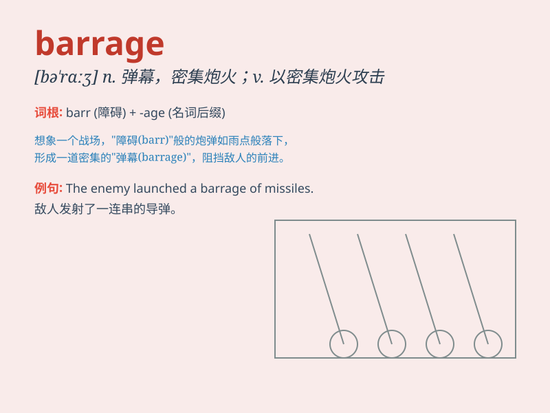

## barrage

**英音:** _[\'bærɑːʒ]_ **美音:** _[bə\'rɑʒ]_

**译义:** *n.拦河坝,堰,阻塞,(敌军前进的)弹幕射击*

### 短语

+ **barrage balloon:** _阻塞气球_

+ **barrage fire:** _弹幕射击_

+ **a barrage of questions:** _连珠炮似的问题_

+ **barrage dam:** _拦河坝_

+ **emotional barrage:** _情感冲击_

### 例句

#### 例句1

> **The soldiers were under a constant barrage of enemy fire.**

**中文翻译:** 士兵们不断受到敌人炮火的攻击。

**单词释义:** 连续的炮火；火力攻击

#### 例句2

> **He was met with a barrage of questions from the reporters.**

**中文翻译:** 他遭到了记者的连串提问。

**单词释义:** 接二连三的一大堆（问题）

#### 例句3

> **The dam was built to withstand the barrage of water during the
flood season.**

**中文翻译:** 大坝的建造是为了抵御洪水季节的洪水。

**单词释义:** （水的）冲击

### 背诵小故事

>
想象一下，在战场上，敌人的炮弹像雨一样袭来，形成了强大的弹幕（barrage）。士兵们躲在掩体后，耳边是炮弹爆炸的轰鸣声。这种密集的炮火攻击就是barrage。

**想象在战场，敌人炮弹如雨形成强大的弹幕，士兵躲避，耳边是爆炸轰鸣，这种密集炮火攻击即barrage。**

### 图义

