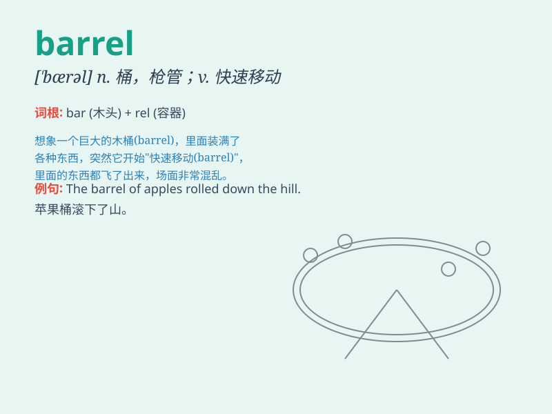

## barrel

**英音:** _[\'bær(ə)l]_ **美音:** _[\'bærəl]_

**译义:** *n.桶vt.装入桶内*

### 短语

+ **barrel organ:** _手摇风琴_

+ **barrel chest:** _桶状胸_

+ **oil barrel:** _油桶_

+ **beer barrel:** _啤酒桶_

+ **barrel roll:** _桶滚（飞行特技动作）_

### 例句

#### 例句1

> **The wine is stored in oak barrels.**

**中文翻译:** 葡萄酒储存在橡木桶中。

**单词释义:** 桶

#### 例句2

> **He could hardly see over the barrel of the gun.**

**中文翻译:** 他几乎看不到枪管外面的东西。

**单词释义:** 枪管

#### 例句3

> **The oil flowed out of the barrel quickly.**

**中文翻译:** 油很快就从桶里流出来了。

**单词释义:** 桶

### 背诵小故事

> A brave adventurer was lost in a forest. He found a barrel full of
water, which saved his life. The barrel became his symbol of hope and
survival. Remember, barrel means a large container, usually cylindrical.

**一位勇敢的探险家在森林中迷路了。他发现了一个装满水的桶，这救了他的命。这个桶成为了他希望和生存的象征。记住，barrel
意思是大桶，通常是圆柱形的。**

### 图义

