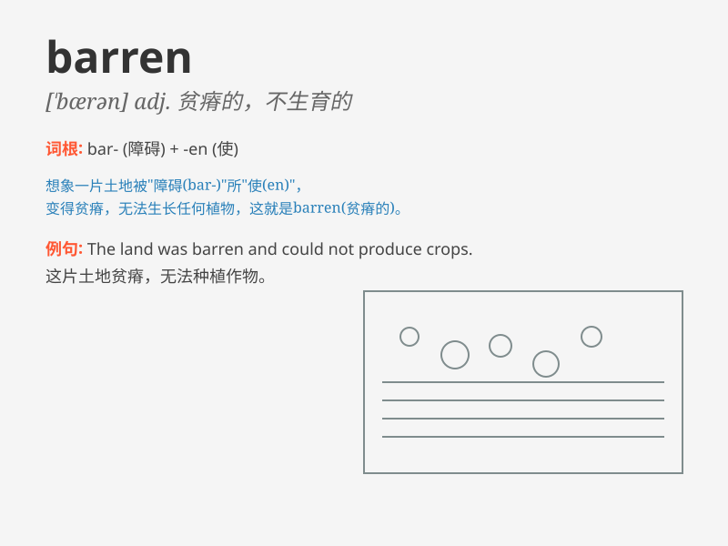

## barren

**英音:** _[\'bær(ə)n]_ **美音:** _[\'bærən]_

**译义:**
*adj.不生育的,不孕的,贫瘠的,没有结果的,无益的,单调的,无聊的,空洞的n.荒地*

### 短语

+ **barren land:** _贫瘠的土地_

+ **barren woman:** _不能生育的妇女_

+ **barren desert:** _荒芜的沙漠_

+ **barren field:** _荒芜的田野_

+ **barren tree:** _不结果实的树_

### 例句

#### 例句1

> **The land was barren and no crops could grow.**

**中文翻译:** 土地贫瘠，庄稼无法生长。

**单词释义:** 贫瘠的；不毛的

#### 例句2

> **She felt barren of ideas for her new project.**

**中文翻译:** 她觉得自己的新项目毫无创意。

**单词释义:** 缺乏的；没有的

#### 例句3

> **The barren tree stood alone in the field.**

**中文翻译:** 那棵光秃秃的树孤零零地矗立在田野里。

**单词释义:** 不结果实的

### 背诵小故事

> A traveler was lost in a barren land. There were no trees, no
flowers, just dry sand and rocks everywhere. He felt hopeless and
lonely. \'Barren\' means lacking in fertility or productivity.

**一位旅行者在一片贫瘠的土地上迷路了。那里没有树木，没有花朵，只有到处都是干燥的沙子和石头。他感到绝望和孤独。\'barren\'意思是贫瘠的、不毛的。**

### 图义

