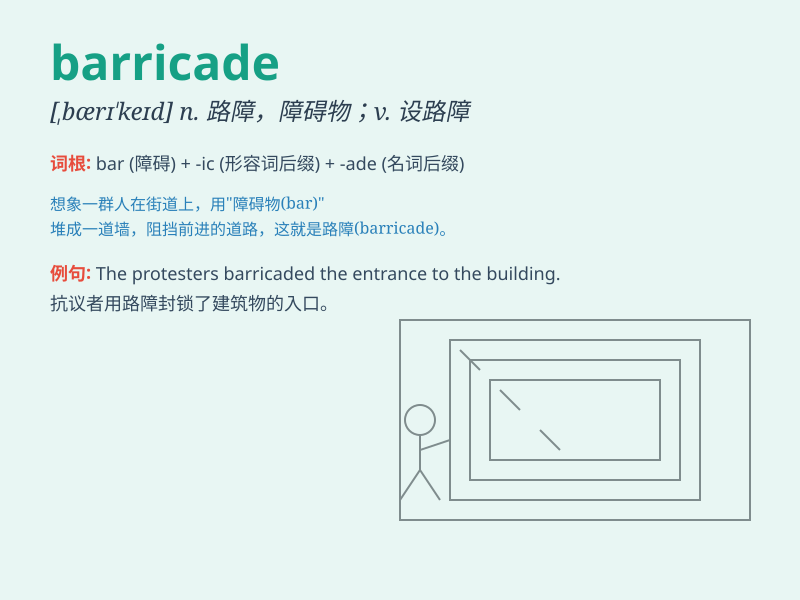

## barricade

**英音:** _[,bærɪ\'keɪd]_ **美音:** _[\'bærɪ\'ked]_

**译义:** *v.设路障n.路障*

### 短语

+ **set up a barricade:** _设置路障_

+ **break through the barricade:** _冲破路障_

+ **barricade oneself in:** _把自己封锁在\...\...里_

+ **remove the barricade:** _移除路障_

+ **behind the barricade:** _在路障后面_

### 例句

#### 例句1

> **The protesters set up a barricade to block the street.**

**中文翻译:** 抗议者设置路障封锁街道。

**单词释义:** 路障；障碍物

#### 例句2

> **The police had to remove the barricades to restore traffic.**

**中文翻译:** 警察不得不拆除路障以恢复交通。

**单词释义:** 路障

#### 例句3

> **They barricaded themselves in the room for safety.**

**中文翻译:** 为了安全起见，他们把自己关在房间里。

**单词释义:** 用障碍物堵住；阻塞

### 背诵小故事

> A thief was running away, but the police quickly set up a barricade
made of wood and metal to stop him. The barricade was so strong that the
thief had no way to escape.

**一个小偷正在逃跑，但警察迅速设置了一个由木头和金属制成的路障来拦住他。这个路障非常坚固，小偷无路可逃。**

### 图义

