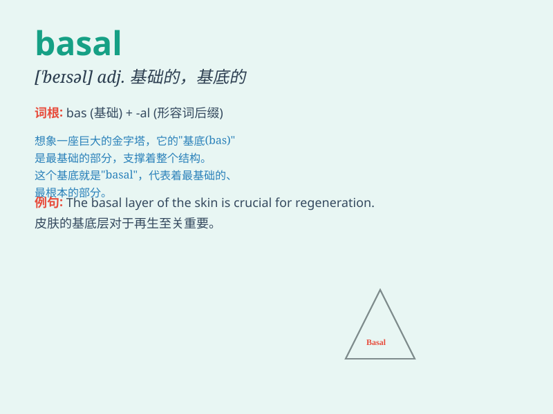

## basal

**英音:** _[\'beɪs(ə)l]_ **美音:** _[\'besl]_

**译义:** *adj.基础的,基本的,基部的,构成基部的*

### 短语

+ **basal metabolism:** _基础代谢_

+ **basal layer:** _基底层_

+ **basal ganglia:** _基底神经节_

+ **basal body:** _基体_

+ **basal cell:** _基底细胞_

### 例句

#### 例句1

> **The basal metabolism rate varies from person to person.**

**中文翻译:** 基础代谢率因人而异。

**单词释义:** 基础的

#### 例句2

> **The basal layer of the epidermis constantly produces new
cells.**

**中文翻译:** 表皮的基底层不断地产生新的细胞。

**单词释义:** 基部的

#### 例句3

> **The basal part of the plant needs more water.**

**中文翻译:** 植物的基部需要更多的水。

**单词释义:** 底部的

### 背诵小故事

> 想象一下，在一个古老的实验室里，有一个基础的神秘盒子，被称为 \'basal
box\' 。这个盒子是所有实验的起点和根本，就像 \'basal\'
这个词是基础、根本的意思。

**想象在古老实验室里有个被称为"basal
box"的基础神秘盒子，它是所有实验起点和根本，就像"basal"表示基础、根本。**

### 图义

