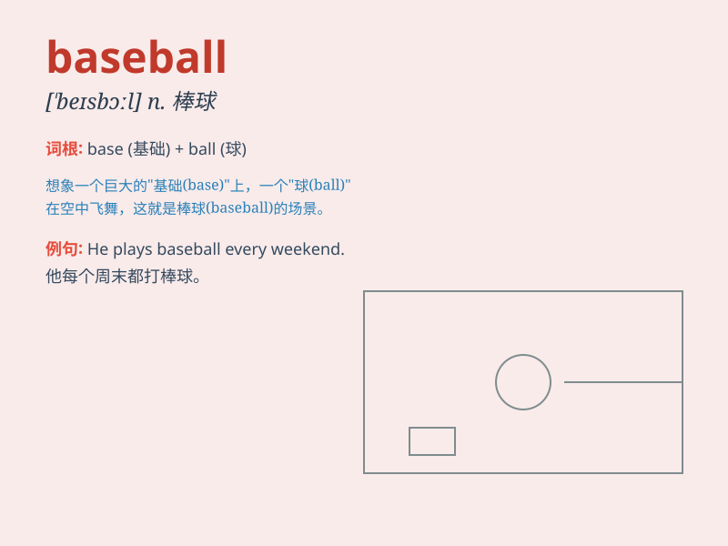

## baseball

**英音:** _[\'beɪsbɔːl]_ **美音:** _[\'besbɔl]_

**译义:** *n.棒球,棒球运动*

### 短语

+ **play baseball:** _打棒球_

+ **baseball game:** _棒球比赛_

+ **baseball bat:** _棒球棒_

+ **baseball cap:** _棒球帽_

+ **baseball team:** _棒球队_

### 例句

#### 例句1

> **I love playing baseball on weekends.**

**中文翻译:** 我喜欢在周末打棒球。

**单词释义:** 棒球

#### 例句2

> **The baseball game attracted a large crowd.**

**中文翻译:** 这场棒球比赛吸引了大批观众。

**单词释义:** 棒球

#### 例句3

> **He is a professional baseball player.**

**中文翻译:** 他是一名职业棒球运动员。

**单词释义:** 棒球

### 背诵小故事

> One sunny day, Tom went to the park and saw a group of kids playing
baseball. They hit the ball hard and ran around the bases. Tom was so
excited and decided to join them. Baseball became his favorite sport.

**在一个阳光明媚的日子，汤姆去公园看到一群孩子在打棒球。他们用力击球并绕着垒跑。汤姆非常兴奋，决定加入他们。棒球成了他最喜欢的运动。**

### 图义

