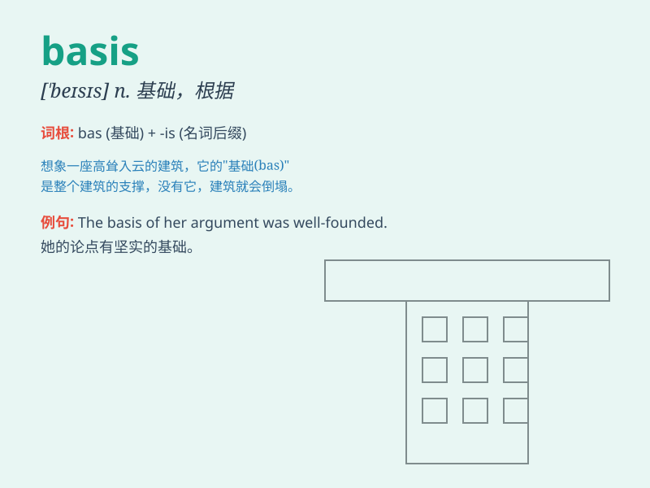

## basis

**英音:** _[\'beɪsɪs]_ **美音:** _[\'besɪs]_

**译义:**
*n.基础,基本,根据,主要成分(或要素),(认识论中的)基本原则或原理*

### 短语

+ **on a regular basis:** _经常；定期_

+ **on the basis of:** _根据；基于_

+ **basis point:** _基点（表示利率变动的最小单位）_

+ **cost basis:** _成本基础_

+ **tax basis:** _计税基础_

### 例句

#### 例句1

> **The basis of their friendship was mutual respect.**

**中文翻译:** 他们友谊的基础是相互尊重。

**单词释义:** 基础

#### 例句2

> **On a daily basis, she exercises for an hour.**

**中文翻译:** 她每天锻炼一小时。

**单词释义:** 以......为基础；按照

#### 例句3

> **This theory has no scientific basis.**

**中文翻译:** 这个理论没有科学依据。

**单词释义:** 依据；根据

### 背诵小故事

>
想象一个探险家在寻宝，他每走一步都依靠一张神秘的地图。这张地图就是他行动的
basis（基础），没有它，探险家就会迷失方向。所以 basis
就是事物存在和发展的根本依据。

**想象一位探险家寻宝依靠的神秘地图是其行动的基础，以此说明 basis
是根本依据的意思。**

### 图义

