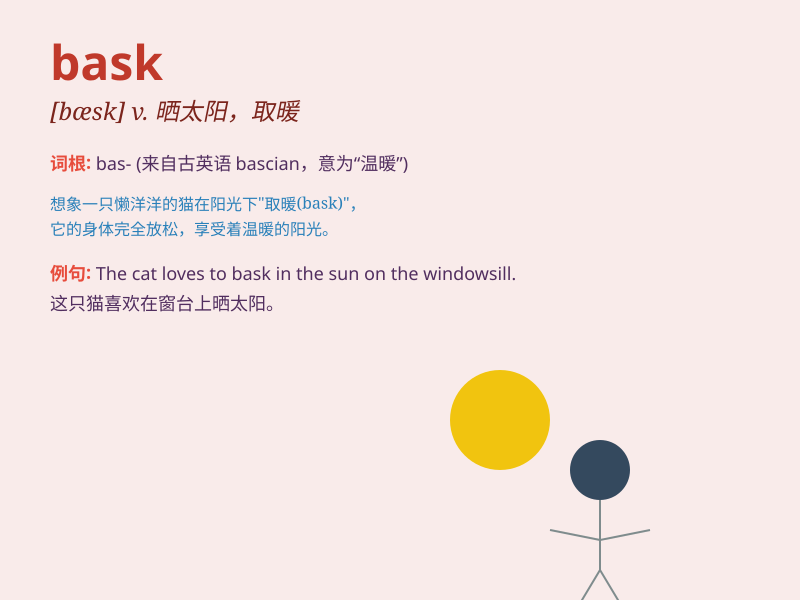

## bask

**英音:** _[bɑːsk]_ **美音:** _[bæsk]_

**译义:** *vi.晒太阳(享受温暖),感到温暖,愉快或舒适*

### 短语

+ **bask in the sun:** _晒太阳_

+ **bask in glory:** _沉浸在荣耀中_

+ **bask in praise:** _陶醉于赞扬_

+ **bask in success:** _享受成功_

+ **bask in someone\'s love:** _沐浴在某人的爱中_

### 例句

#### 例句1

> **I love to bask in the sun on the beach.**

**中文翻译:** 我喜欢在海滩上晒太阳。

**单词释义:** 晒太阳；取暖

#### 例句2

> **The cat was basking in the warmth of the fire.**

**中文翻译:** 猫在炉火的温暖中取暖。

**单词释义:** 享受温暖；沉浸于温暖

#### 例句3

> **She basked in the glory of her success.**

**中文翻译:** 她沉浸在成功的荣耀之中。

**单词释义:** 沉浸于；享受

### 背诵小故事

> One sunny day, a little cat found a warm spot and lay down to bask in
the sunlight. It felt so cozy and happy. The cat just enjoyed the gentle
heat, and this is what \'bask\' means - to lie in or be exposed to
pleasant warmth.

**在一个阳光明媚的日子，一只小猫找到了一个温暖的地方躺下来晒太阳。它感到非常舒适和开心。小猫就享受着这柔和的热度，这就是'bask'的意思------沐浴于，晒太阳**

### 图义

