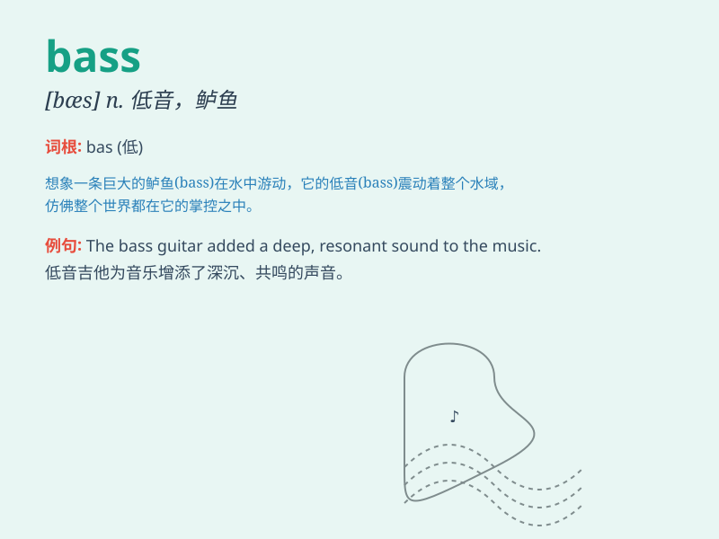

## bass

**英音:** _[beɪs]_ **美音:** _[bes]_

**译义:** *n.低音部,男低音,低音乐器adj.低音的*

### 短语

+ **bass guitar:** _低音吉他_

+ **double bass:** _低音提琴_

+ **bass voice:** _低沉的嗓音_

+ **bass line:** _低音线；低音旋律_

+ **bass drum:** _低音鼓_

### 例句

#### 例句1

> **The bass guitar provides the low-pitched rhythm in the band.**

**中文翻译:** 在乐队中，低音吉他提供了低沉的节奏。

**单词释义:** 低音吉他

#### 例句2

> **The lake is known for its large bass fish.**

**中文翻译:** 这个湖以其大鲈鱼而闻名。

**单词释义:** 鲈鱼

#### 例句3

> **The singer\'s voice had a rich bass quality.**

**中文翻译:** 这位歌手的嗓音具有深沉的低音特质。

**单词释义:** 低音；男低音

### 背诵小故事

> A fisherman was very happy when he caught a big bass. But the bass
struggled hard and almost broke the fishing line. Finally, the fisherman
managed to pull it up. The bass was so heavy!

**一位渔夫在钓到一条大鲈鱼时非常高兴。但鲈鱼拼命挣扎，几乎挣断鱼线。最终，渔夫设法把它拉了上来。这条鲈鱼可真重！**

### 图义

