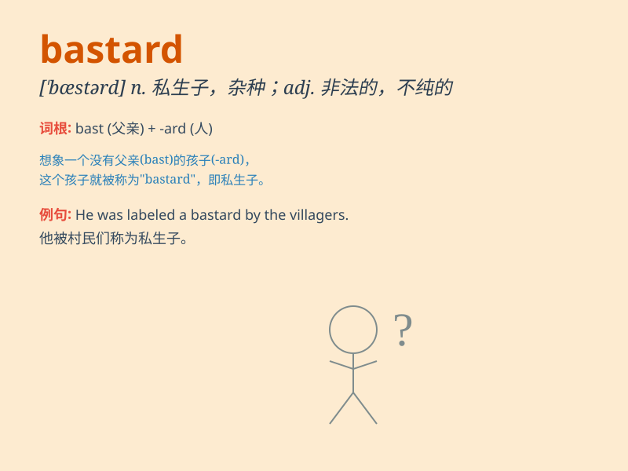

## bastard

**英音:** _[\'bɑːstəd; \'bæst-]_ **美音:** _[\'bæstɚd]_

**译义:** *n.私生子*

### 短语

+ **son of a bastard:** _私生子的儿子_

+ **bastard file:** _不合格的锉刀_

+ **bastard size:** _非标准尺寸_

+ **bastard amber:** _劣质琥珀_

+ **bastard wing:** _副翼_

### 例句

#### 例句1

> **He\'s a real bastard for doing that to her.**

**中文翻译:** 他那样对她，真是个混蛋。

**单词释义:** 混蛋；坏蛋

#### 例句2

> **The poor child was born a bastard.**

**中文翻译:** 这个可怜的孩子是个私生子。

**单词释义:** 私生子

#### 例句3

> **This is a bastard job. I don\'t want to do it anymore.**

**中文翻译:** 这是个棘手的工作。我不想再做了。

**单词释义:** 棘手的；讨厌的

### 背诵小故事

> 从前有个被人遗弃的孩子，大家都叫他
Bastard。他身世可怜，没人关爱。但他凭借自己的努力，最终改变了命运。记住这个可怜又坚强的孩子，就能记住
Bastard 这个词，表示私生子、杂种的意思。

**从前有个被叫做私生子、杂种的孩子，他虽身世可怜但努力改变命运。通过这个故事记住
bastard 这个词的意思。**

### 图义

