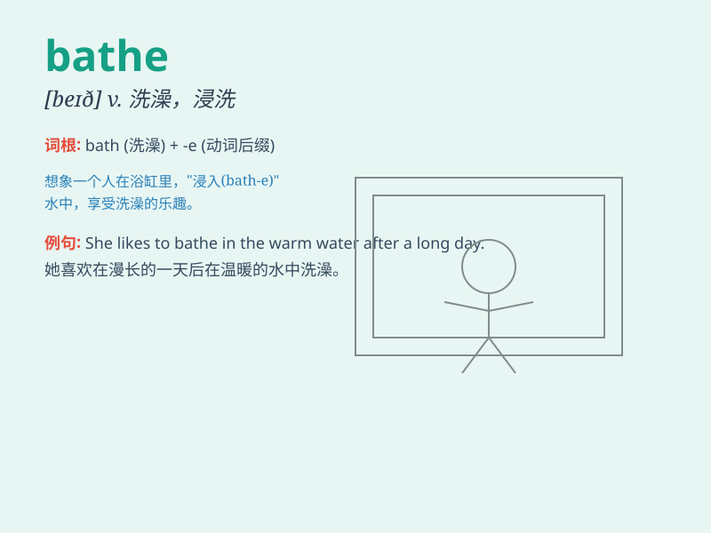

## bathe

**英音:** _[beɪð]_ **美音:** _[beð]_

**译义:** *v.沐浴,洗,(光线)充满n.洗澡*

### 短语

+ **bathe in:** _沉浸于；沐浴在_

+ **go bathing:** _去游泳；去洗澡_

+ **bathe oneself:** _给自己洗澡_

+ **sun bathe:** _晒太阳浴_

+ **bathe regularly:** _定期洗澡_

### 例句

#### 例句1

> **I like to bathe in the river in summer.**

**中文翻译:** 夏天我喜欢在河里洗澡。

**单词释义:** 洗澡；沐浴

#### 例句2

> **The doctor advised him to bathe his eyes twice a day.**

**中文翻译:** 医生建议他每天洗两次眼睛。

**单词释义:** 洗；冲洗

#### 例句3

> **The sun bathed the fields in golden light.**

**中文翻译:** 阳光使田野沐浴在金色的光辉中。

**单词释义:** （以光线）撒满；覆盖

### 背诵小故事

> A little bear was very dirty after playing in the forest. So, its
mother took it to the river and helped it bathe. The water was so cool
and refreshing, and the little bear became clean and happy.

**一只小熊在森林里玩耍后变得非常脏。于是，它的妈妈带它到河边并帮它洗澡。水又凉又清爽，小熊变得干净又开心。**

### 图义

