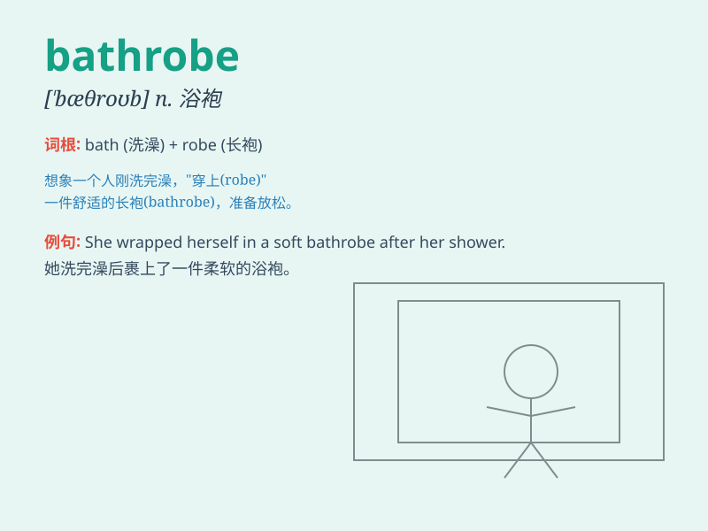

## bathrobe

**英音:** _[\'bɑːθrəʊb]_ **美音:** _[\'bæθrob]_

**译义:** *n.浴衣*

### 短语

+ **put on a bathrobe:** _穿上浴袍_

+ **wear a bathrobe:** _穿着浴袍_

+ **take off a bathrobe:** _脱下浴袍_

+ **fold a bathrobe:** _叠浴袍_

+ **hang up a bathrobe:** _挂起浴袍_

### 例句

#### 例句1

> **She wrapped herself in a warm bathrobe after taking a bath.**

**中文翻译:** 她洗完澡后裹上了一件温暖的浴袍。

**单词释义:** 浴袍

#### 例句2

> **The hotel provided guests with fluffy bathrobes.**

**中文翻译:** 这家酒店为客人提供了柔软的浴袍。

**单词释义:** 浴袍

#### 例句3

> **He put on his bathrobe and went to answer the door.**

**中文翻译:** 他穿上浴袍去应门。

**单词释义:** 浴袍

### 背诵小故事

> One cold winter night, Tom was shivering. Suddenly, he remembered his
warm bathrobe in the closet. He quickly put it on and felt cozy
immediately. The bathrobe saved him from the cold.

**一个寒冷的冬夜，汤姆冻得发抖。突然，他想起衣柜里那件温暖的浴袍。他迅速穿上，立刻感到舒适温暖。浴袍让他免受寒冷。**

### 图义

