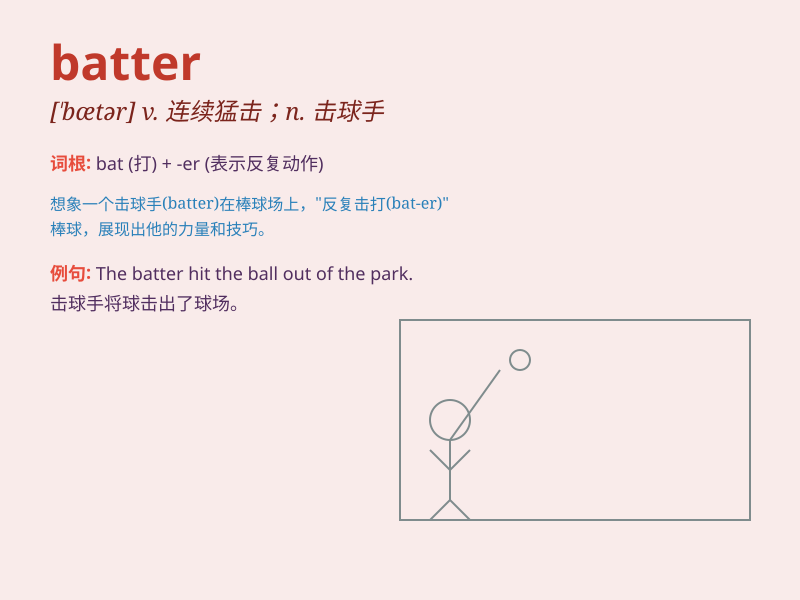

## batter

**英音:** _[\'bætə]_ **美音:** _[\'bætɚ]_

**译义:** *n.击球手v.打坏,猛击*

### 短语

+ **batter down:** _撞倒；打破；砸烂_

+ **batter up:** _准备好击球_

+ **cake batter:** _蛋糕糊_

+ **batter out:** _敲出_

+ **batter away:** _连续猛击_

### 例句

#### 例句1

> **The waves battered the shore.**

**中文翻译:** 海浪不断拍打海岸。

**单词释义:** 连续猛击；撞击

#### 例句2

> **The baseball player was constantly battered by pitches.**

**中文翻译:** 这位棒球运动员不断被投球击中。

**单词释义:** （被）猛击；（被）击打

#### 例句3

> **She battered the eggs in a bowl.**

**中文翻译:** 她在碗里把鸡蛋打散。

**单词释义:** 连续猛敲；捣毁

### 背诵小故事

> A baseball player was at bat. He was trying to hit the ball hard. But
the pitcher was good and the ball kept coming in tricky ways. The player
had to keep swinging hard, trying to batter the ball.

**一位棒球运动员正在击球。他努力用力击球。但投手很棒，球总是以刁钻的方式过来。这位球员不得不一直用力挥棒，试图猛击球。**

### 图义

