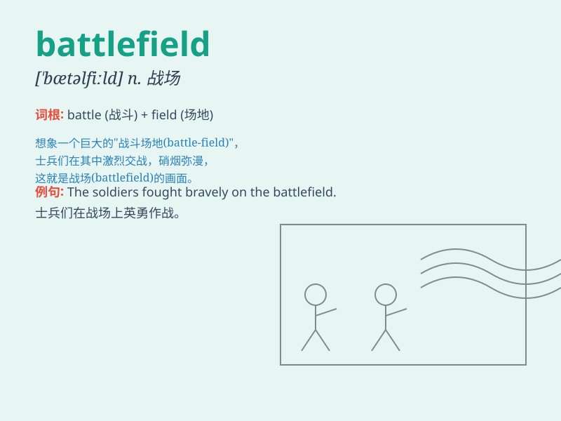

## battlefield

**英音:** _[\'bæt(ə)lfiːld]_ **美音:** _[\'bætlfild]_

**译义:** *n.战场,沙场*

### 短语

+ **on the battlefield:** _在战场上_

+ **battlefield conditions:** _战场条件_

+ **battlefield experience:** _战场经验_

+ **enter the battlefield:** _进入战场_

+ **leave the battlefield:** _离开战场_

### 例句

#### 例句1

> **The soldiers were deployed on the battlefield.**

**中文翻译:** 士兵们被部署在战场上。

**单词释义:** 战场

#### 例句2

> **The battlefield was littered with the debris of war.**

**中文翻译:** 战场上到处都是战争的残骸。

**单词释义:** 战场

#### 例句3

> **He emerged victorious from the battlefield.**

**中文翻译:** 他从战场上胜利归来。

**单词释义:** 战场

### 背诵小故事

> A brave soldier was sent to the battlefield. There, he faced fierce
enemies but remained courageous. The battlefield was filled with smoke
and chaos. He fought hard to protect his comrades and his country.

**一位勇敢的士兵被派往战场。在那里，他面对着凶猛的敌人但依然勇敢。战场充满了硝烟和混乱。他奋力战斗以保护他的战友和国家。**

### 图义

