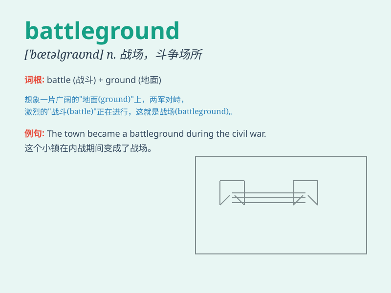

## battleground

**英音:** _[ˈbætlgraʊnd]_ **美音:** _[ˈbætəlˌgraʊnd]_

**译义:** *n.战场*

### 短语

+ **military battleground:** _军事战场_

+ **political battleground:** _政治战场_

+ **battleground state:**
_战场州（指在美国总统大选中竞争激烈、胜负难分的州）_

+ **commercial battleground:** _商业战场_

+ **ideological battleground:** _意识形态战场_

### 例句

#### 例句1

> **The soldiers were sent to the battleground to defend their
country.**

**中文翻译:** 士兵们被派往战场去保卫他们的国家。

**单词释义:** 战场

#### 例句2

> **The political battleground was fierce during the election.**

**中文翻译:** 在选举期间，政治战场十分激烈。

**单词释义:** 争斗场所

#### 例句3

> **The battleground of business competition is constantly
changing.**

**中文翻译:** 商业竞争的战场在不断变化。

**单词释义:** 竞争场所

### 背诵小故事

> In a faraway land, there was a place called Battleground. Every year,
two powerful armies would meet here to fight for victory. It was a field
filled with tension and courage. Soldiers knew this was the battleground
where their fate would be decided.

**在一个遥远的地方，有一个叫做战场的地方。每年，两支强大的军队都会在这里相遇，为胜利而战。这是一个充满紧张和勇气的地方。士兵们知道这是决定他们命运的战场。**

### 图义

