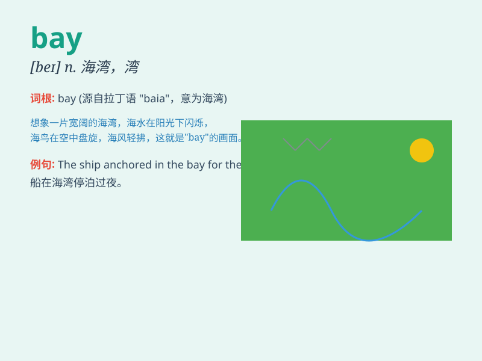

## bay

**英音:** _[beɪ]_ **美音:** _[be]_

**译义:** *n.海湾,狗吠声,绝路vt.吠,使走投无路vi.吠*

### 短语

+ **at bay:** _（猎物等） 被困；走投无路；处于困境_

+ **keep at bay:** _使无法近身；防止...接近_

+ **bay window:** _凸窗_

+ **bay leaf:** _月桂叶_

+ **bay rum:** _月桂香水_

### 例句

#### 例句1

> **The ship was moored in the bay.**

**中文翻译:** 船停泊在海湾里。

**单词释义:** 海湾

#### 例句2

> **The dog bayed at the moon.**

**中文翻译:** 那只狗对着月亮狂吠。

**单词释义:** （狗）连续吠叫

#### 例句3

> **She has a bay window in her living room.**

**中文翻译:** 她的客厅有一扇凸窗。

**单词释义:** 凸窗

### 背诵小故事

> A brave sailor was on a long journey. When he reached a beautiful
place, he saw a big bay. The water was calm and the view was amazing. He
decided to rest there and enjoy the peace of the bay.

**一位勇敢的水手正在长途旅行。当他到达一个美丽的地方时，他看到了一个大港湾。那里的水很平静，景色迷人。他决定在那里休息，享受港湾的宁静。**

### 图义

