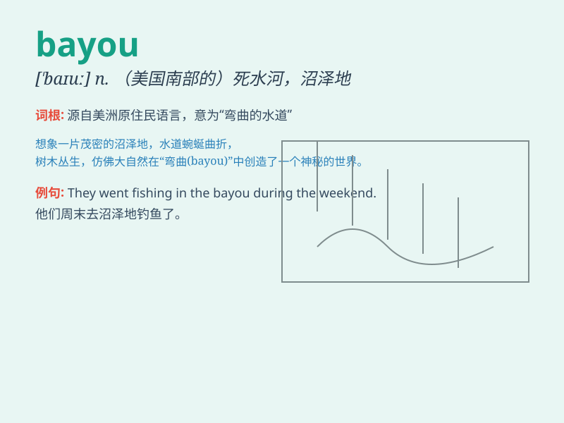

## bayou

**英音:** _[\'baɪuː]_ **美音:** _[\'baɪu]_

**译义:** *n.小海湾,支流,河口*

### 短语

+ **bayou country:** _河口地区_

+ **bayou bridge:** _河口桥梁_

+ **bayou water:** _河口的水_

+ **bayou landscape:** _河口景观_

+ **bayou ecosystem:** _河口生态系统_

### 例句

#### 例句1

> **We went fishing in the bayou and caught a lot of catfish.**

**中文翻译:** 我们去河口钓鱼，钓到了很多鲶鱼。

**单词释义:** 河口湾；支流

#### 例句2

> **The bayou was filled with alligators and turtles.**

**中文翻译:** 河口充满了鳄鱼和海龟。

**单词释义:** 河口湾；沼泽小河

#### 例句3

> **They explored the mysterious bayou by canoe.**

**中文翻译:** 他们乘独木舟探索神秘的河口。

**单词释义:** 河口湾；河汊

### 背诵小故事

> A brave adventurer was lost in a strange land. He came across a
slow-flowing waterway called a bayou. With tall trees on both sides, it
was a mysterious place. But he finally found his way out by following
the bayou.

**一位勇敢的探险家在陌生的地方迷路了。他遇到了一条缓慢流动的水道，叫做bayou（河口、支流）。两边是高大的树木，这是个神秘的地方。但他最终沿着bayou找到了出路。**

### 图义

